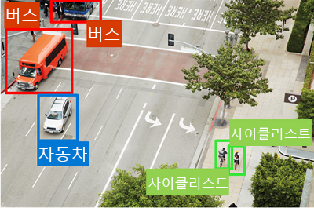

# 기본 AI 개념

## 목차
 - [AI 소개](#ai-소개)
 - [기계 학습 이해](#기계-학습-이해)
 - [Computer vision 이해](#computer-vision-이해)
 - [자연어 처리 이해](#자연어-처리-이해)
 - [문서 인텔리전스 및 지식 마이닝 이해](#문서-인텔리전스-및-지식-마이닝-이해)
 - [생성형 AI 이해](#생성형-ai-이해)
 - [AI를 사용할 때의 해결 과제 및 위험](#ai를-사용할-때의-해결-과제-및-위험)
 - [담당 AI 이해](#담당-ai-이해)
 - [요약](#요약)
 - [출처](#출처)

---
## AI 소개
AI를 사용하여 의료 분야를 개선하고, 사용자들이 신체적 결함을 극복하고, 스마트 인프라를 지원하고, 뛰어난 엔터테인먼트 환경을 만들고, 지구 행성을 구할 수 있는 놀라운 소프트웨어를 구축할 수 있습니다.

[AI를 사용할 수 있는 몇 가지 방법을 보려면 다음 비디오를 시청하세요.](https://www.microsoft.com/ko-kr/videoplayer/embed/RE4vyDl?postJsllMsg=true&autoCaptions=ko-kr)

### AI란 무엇인가요?
간단히 말해서 AI는 인간의 동작과 기능을 모방하는 소프트웨어입니다. 주요 워크로드는 다음과 같습니다.

 - 기계 학습: 이것은 AI 시스템의 기반이자, 데이터를 바탕으로 예측을 수행하고 결론을 도출하기 위해 우리가 컴퓨터 모델을 “가르치는” 방법입니다.
 - Computer Vision - 카메라, 동영상, 이미지를 통해 세상을 시각적으로 해석하는 AI 내 기능입니다.
 - 자연어 처리 - 컴퓨터가 서면 또는 음성을 해석하고 친절하게 응답하는 AI 내 기능입니다.
 - 문서 인텔리전스 - 양식 및 문서에 있는 대량의 데이터를 관리, 처리 및 사용하는 AI 내 기능입니다.
 - 지식 마이닝 - 구조화되지 않은 대용량 데이터에서 정보를 추출하여 검색 가능한 지식 저장소를 만드는 AI 내 기능입니다.
 - 생성 AI - 자연어, 이미지, 코드 등을 포함한 다양한 형식으로 독창적인 콘텐츠를 만드는 AI 내 기능입니다.
---
## 기계 학습 이해
기계 학습은 AI 솔루션 대부분의 토대입니다. 1950년대 이후 데이터 과학자라고 알려진 연구원들은 AI에 대한 다양한 접근 방식을 연구해 왔습니다. 대부분의 최신 AI 애플리케이션은 컴퓨터 과학과 수학을 결합한 AI 분기인 기계 학습에 기원을 둡니다.

먼저 기계 학습을 사용하여 어려운 문제를 해결하는 방법에 대한 실제 예제를 살펴보겠습니다.

지속 가능한 경작 기술은 손상된 환경을 보호하는 동시에 식량 생산을 최대화하는 데 필수적입니다. 오스트레일리아에 있는 농업 기술 회사인 The Yield는 센서, 데이터 및 기계 학습을 사용하여 농부들이 날씨, 토양 및 식물 상태와 관련하여 합리적인 의사 결정을 내리도록 도와줍니다.

[자세히 알아보려면 다음 비디오를 참조하세요.](https://www.microsoft.com/ko-kr/videoplayer/embed/RE4voJG?postJsllMsg=true&autoCaptions=ko-kr)

### 기계 학습 작동 방법
그렇다면 기계는 어떻게 학습합니까?

답은 데이터로부터 배운다는 것입니다. 오늘날의 세계에서 우리는 일상 생활을 하면서 엄청난 양의 데이터를 생성합니다. 우리는 문자 메세지, 메일 그리고 소셜 미디어 게시물부터 휴대폰으로 찍은 사진 및 동영상까지 전송합니다. 우리는 엄청난 양의 정보를 생성합니다. 여전히 가정, 자동차, 도시, 대중교통 인프라 및 공장의 수백만 개의 센서에 의해 많은 데이터가 생성됩니다.

데이터 과학자는 모든 데이터를 사용하여 데이터에서 찾은 관계를 기반으로 예측 및 추론을 할 수 있는 기계 학습 모델을 학습시킬 수 있습니다.

기계 학습 모델은 데이터 간의 관계를 포착하려고 합니다. 예를 들어 환경 보호 조직이 자원 봉사자가 휴대폰 앱을 사용하여 다양한 종류의 야생화를 식별하고 카탈로그화하기를 원한다고 가정해 보겠습니다. 다음 애니메이션에서는 이러한 시나리오를 활성화하기 위해 어떻게 기계 학습이 사용될 수 있는 지를 보여줍니다.

1. 야생화 샘플에 대한 데이터를 수집하는 식물학자와 과학자로 구성된 팀.
2. 팀은 샘플을 종별로 정확히 분류하여 레이블을 지정합니다.
3. 레이블이 지정된 데이터는 샘플의 특징과 레이블이 지정된 종 사이의 관계를 찾는 알고리즘을 사용하여 처리됩니다.
4. 알고리즘의 결과는 모델에 요약됩니다.
5. 자원 봉사자에 의해 새로운 샘플이 발견되면 모델은 올바른 종 레이블을 식별할 수 있습니다.

AI에 대한 접근 방식은 훨씬 더 복잡한 작업을 수행하도록 발전해 왔습니다. 이러한 복잡한 모델은 AI 기능의 기반을 형성합니다.

### Microsoft Azure의 Machine Learning
Microsoft Azure는 기계 학습 모델을 생성, 관리 및 게시하기 위한 클라우드 기반 플랫폼인 Azure Machine Learning 서비스를 제공합니다. Azure Machine Learning Studio는 다음과 같은 여러 제작 환경을 제공합니다.

 - 자동화된 ML: 이 기능은 비전문가도 데이터를 활용하여 효과적인 기계 학습 모델을 빠르게 만들 수 있도록 지원합니다.
 - Azure Machine Learning 디자이너: 코딩 작업 없이 기계 학습 솔루션을 개발할 수 있는 그래픽 인터페이스입니다.
 - 데이터 메트릭 시각화: 시각화를 사용하여 실험을 분석하고 최적화합니다.
 - Notebooks: 스튜디오에 직접 통합된 관리되는 Jupyter Notebook 서버에서 직접 코드를 작성하고 실행합니다.

---
## Computer vision 이해
컴퓨터 비전은 시각적 처리를 다루는 AI 분야입니다. 컴퓨터 비전으로 구현되는 몇 가지 가능성을 살펴보겠습니다.

Seeing AI 앱은 컴퓨터 비전 기능을 잘 보여 주는 예제입니다. 시각 장애인을 위해 디자인된 Seeing AI 앱은 AI의 능력을 이용하여 시각적 세계를 열고 가까이에 있는 사람, 텍스트 및 사물를 설명합니다.

[Seeing AI에 대해 자세히 알아보려면 다음 영상을 시청하세요.](https://www.microsoft.com/ko-kr/videoplayer/embed/RE4vC2Q?postJsllMsg=true&autoCaptions=ko-kr)

### 컴퓨터 비전 모델 및 기능
|작업|설명|
|---|---|
|이미지 분류| 이미지 분류에는 콘텐츠에 따라 이미지를 분류하는 기계 학습 모델 교육이 포함됩니다. 예를 들어 트래픽 모니터링 솔루션에서는 이미지 분류 모델을 사용하여 택시, 버스, 자전거 타는 사람 등 포함된 차량 유형에 따라 이미지를 분류할 수 있습니다.|
|개체 감지| 개체 감지 기계 학습 모델은 이미지 내의 개별 개체를 분류하고 경계 상자를 사용하여 해당 위치를 식별하도록 학습됩니다. 예를 들어 트래픽 모니터링 솔루션은 개체 감지를 사용하여 다양한 차량 클래스의 위치를 식별할 수 있습니다.|
|얼굴 감지, 분석 및 인식| 얼굴 감지는 이미지에서 사람의 얼굴을 찾는 특수한 형태의 개체 감지입니다. 이를 분류 및 얼굴 기하 도형 분석 기술과 결합하여 얼굴 기능에 따라 개인을 인식할 수 있습니다.|
|OCR(광학 문자 인식)| 광학 문자 인식은 이미지의 텍스트를 검색하고 읽는 데 사용되는 기술입니다. OCR을 사용하여 사진(예: 도로 표지판 또는 스토어 전면)에서 텍스트를 읽거나 문자, 송장 또는 양식과 같은 스캔된 문서에서 정보를 추출할 수 있습니다.|

### Microsoft Azure의 컴퓨터 비전 서비스
Microsoft의 Azure AI 비전을 사용하여 Computer Vision 솔루션을 개발할 수 있습니다. 서비스 기능은 Azure Vision Studio 및 기타 프로그래밍 언어에서 사용하고 테스트할 수 있습니다. Azure AI 비전의 일부 기능은 다음과 같습니다.

 - 이미지 분석: 이미지와 동영상을 분석하고 설명, 태그, 개체 및 텍스트를 추출하는 기능입니다.
 - Face: 얼굴 감지 및 얼굴 인식 솔루션을 빌드할 수 있는 기능입니다.
 - OCR(광학 인식): 이미지에서 인쇄되거나 손으로 쓴 텍스트를 추출하여 검사한 텍스트의 디지털 버전에 액세스할 수 있는 기능입니다.
---
## 자연어 처리 이해
NLP(자연어 처리)는 문어와 구어를 이해하는 소프트웨어 생성을 다루는 AI 영역입니다.

NLP를 사용하면 다음과 같은 소프트웨어를 만들 수 있습니다.

 - 문서, 메일 메시지 및 기타 원본의 텍스트를 분석하고 해석합니다.
 - 음성 언어를 해석하고 음성 응답을 합성합니다.
 - 언어 간 구어 또는 문어 구를 자동으로 번역합니다.
 - 명령을 해석하고 적절한 작업을 결정합니다.

예를 들어, Starship Commander는 공상 과학 세계에서 발생하는 Human Interact의 VR(가상 현실) 게임입니다. 이 게임에서는 자연어 처리를 사용하여 플레이어가 내레이션을 제어하고 게임 내 문자 및 우주선 시스템과 상호 작용할 수 있도록 합니다.

[자세히 알아보려면 다음 영상을 시청하세요.](https://www.microsoft.com/ko-kr/videoplayer/embed/RE4vyDj?postJsllMsg=true&autoCaptions=ko-kr)

### Microsoft Azure의 자연어 처리

Microsoft의 Azure AI 언어를 사용하여 자연어 처리 솔루션을 빌드할 수 있습니다. Azure AI 언어의 일부 기능에는 텍스트 이해 및 분석, 음성 또는 텍스트 기반 명령을 이해할 수 있는 대화형 언어 모델 학습, 지능형 애플리케이션 빌드가 포함됩니다.

Microsoft의 Azure AI 음성은 자연어 처리 솔루션을 빌드하는 데 사용할 수 있는 또 다른 서비스입니다. Azure AI 음성 기능에는 음성 인식 및 합성, 실시간 번역, 대화 기록 등이 포함됩니다.

Azure Language Studio에서 Azure AI 언어 기능을 탐색하고 Azure Speech Studio에서 Azure AI 음성 기능을 탐색할 수 있습니다. 서비스 기능은 스튜디오 및 기타 프로그래밍 언어에서 사용하고 테스트할 수 있습니다.

---
## 문서 인텔리전스 및 지식 마이닝 이해

### 문서 인텔리전스
문서 인텔리전스는 양식 및 문서에 있는 다양한 데이터의 대량 관리, 처리 및 사용을 다루는 AI 영역입니다. 문서 인텔리전스를 사용하면 계약, 상태 문서, 재무 양식 등에 대한 처리를 자동화할 수 있는 소프트웨어를 만들 수 있습니다.

### Microsoft Azure의 문서 인텔리전스

Microsoft의 Azure AI 문서 인텔리전스를 사용하여 스캔한 문서에서 데이터 수집을 관리하고 가속화하는 솔루션을 빌드할 수 있습니다. Azure AI 문서 인텔리전스의 기능은 애플리케이션 및 워크플로에서 문서 처리를 자동화하고, 데이터 기반 전략을 향상하고, 문서 검색 기능을 보강하는 데 도움이 됩니다. 미리 빌드된 모델을 사용하여 청구서, 영수증, 건강 보험 카드, 세금 양식 등에 대한 지능형 문서 처리 기능을 추가할 수 있습니다. Azure AI 문서 인텔리전스를 사용하여 레이블이 지정된 사용자 지정 데이터 세트로 사용자 지정 모델을 만들 수도 있습니다. 서비스 기능은 Document Intelligence Studio 및 기타 프로그래밍 언어에서 사용 및 테스트할 수 있습니다.

### 지식 마이닝
지식 마이닝은 종종 대량의 비정형 데이터에서 정보를 추출하여 검색 가능한 지식 저장소를 만드는 솔루션을 설명하는 데 사용되는 용어입니다.

### Microsoft Azure에서의 지식 마이닝
One Microsoft 지식 마이닝 솔루션은 인덱스 빌드 도구가 포함된 프라이빗, 엔터프라이즈, 검색 솔루션인 Azure AI 검색입니다. 그런 다음, 인덱스는 내부 전용으로 사용하거나 공개 인터넷 자산에서 검색 가능한 콘텐츠를 활성화하는 데 사용할 수 있습니다.

Azure AI Search는 이미지 처리, 문서 인텔리전스 및 자연어 처리와 같은 Azure AI 서비스의 기본 제공 AI 기능을 활용하여 데이터를 추출할 수 있습니다. 제품의 AI 기능을 사용하면 이전에 검색할 수 없었던 문서를 인덱싱하고 대량의 데이터에서 신속하게 인사이트를 추출하고 노출할 수 있습니다.

---
## 생성형 AI 이해
생성형 AI는 원본 콘텐츠를 만드는 AI 내 기능 범주를 설명합니다. 사람은 일반적으로 채팅 애플리케이션에 기본 제공된 생성형 AI와 상호 작용합니다. 생성형 AI 애플리케이션은 자연어 입력을 사용하고 자연어, 이미지, 코드 및 오디오와 같은 다양한 형식으로 적절한 응답을 반환합니다.

### Microsoft Azure의 생성형 AI
Microsoft Azure에서 Azure OpenAI 서비스를 사용하여 생성형 AI 솔루션을 빌드할 수 있습니다. Azure OpenAI Service는 생성형 AI 모델을 배포, 사용자 지정 및 호스트하기 위한 Microsoft의 클라우드 솔루션입니다. 이 솔루션은 최고의 OpenAI 최첨단 모델 및 API를 Azure 클라우드 플랫폼의 보안 및 스케일링 성능과 결합합니다.

Azure OpenAI는 다양한 요구 사항을 충족할 수 있는 많은 기본 모델을 선택할 수 있게 해 줍니다. 서비스 기능은 Azure OpenAI Studio 및 기타 프로그래밍 언어에서 사용 및 테스트할 수 있습니다. Azure OpenAI Studio 사용자 인터페이스를 사용하여 생성형 AI 모델을 관리, 개발 및 사용자 지정할 수 있습니다.

---
## AI를 사용할 때의 해결 과제 및 위험

인공 지능은 세상에 큰 도움을 주기 위해 활용할 수 있는 강력한 도구입니다. 그러나 다른 도구와 같이 책임감 있게 사용해야 합니다.

다음 표에서는 AI 애플리케이션 개발자가 직면하는 몇 가지 잠재적인 문제 및 위험을 보여줍니다.

| 해결 과제 또는 위험                     | 예제                                                      |
|---------------------------------|---------------------------------------------------------|
| 바이어스는 결과에 영향을 줄 수 있습니다.         | 대출 승인 모델은 학습된 데이터의 바이어스로 인해 성별에 따라 차별합니다.               |
| 오류로 인해 해로울 수 있습니다.              | 자율 주행 차량에서 시스템 오류가 발생하여 충돌이 발생합니다.                      |
| 데이터가 노출될 수 있습니다.                | 의료 진단 봇이 중요한 환자 데이터로 학습되지만 이러한 데이터가 안전하지 않게 저장되어 있습니다.  |
| 해결 방법이 모든 사용자에게 작동하지 않을 수 있습니다. | 홈 오토메이션 도우미는 시각 장애가 있는 사용자를 위한 오디오 출력을 제공하지 않습니다.       |
| 사용자는 복잡한 시스템을 신뢰해야 합니다.         | AI 기반 재무 도구는 투자 권장 지침을 제공합니다. 이러한 권장 사항은 무엇을 기준으로 할까요?  |
| AI 기반 결정은 누구의 책임인가요?            | 안면 인식 증거에 따라 죄없는 사람이 범죄자로 확인되었습니다. 누구의 책임인가요?           |

---
## 담당 AI 이해

Microsoft에서 AI 소프트웨어 개발은 AI 애플리케이션이 의도하지 않은 부정적인 결과 없이 어려운 문제에 대한 놀라운 솔루션을 제공하도록 설계된 6가지 원칙 집합에 의해 안내됩니다.

### 공정성
AI 시스템은 모든 사람을 공평하게 대해야 합니다. 예를 들어 은행의 대출 승인 애플리케이션을 지원하는 기계 학습 모델을 만든다고 가정합니다. 모델은 대출이 바이어스 없이 승인되거나 거부되어야 하는지를 예측해야 합니다. 이러한 바이어스는 성별, 민족 또는 특정 신청자 그룹에게 불공정한 이익 또는 불이익을 주는 기타 요인을 기반으로 할 수 있습니다.

Azure Machine Learning에는 모델을 해석하고 데이터의 각 기능이 모델의 예측에 영향을 미치는 정도를 정량화하는 기능이 포함됩니다. 이 기능을 통해 데이터 과학자와 개발자는 모델의 바이어스를 식별하고 완화할 수 있습니다.

또 다른 예로 Microsoft가 Face 서비스를 통해 책임 있는 AI를 구현한 경우 감정 상태 및 ID 특성을 유추하는 데 사용할 수 있는 얼굴 인식 기능을 사용 중지합니다. 이러한 기능은 오용될 경우 사람들이 고정 관념, 차별 또는 불공정한 서비스 거부를 겪을 수 있습니다.

[공정성과 관련된 고려 사항에 대한 자세한 내용을 보려면 다음 비디오를 시청하세요.](https://www.microsoft.com/ko-kr/videoplayer/embed/RE4vqfa?postJsllMsg=true&autoCaptions=ko-kr)

### 신뢰성 및 안전성

AI 시스템은 안정적이고 안전한 방식으로 작동해야 합니다. 예를 들어 자율 주행 차량에 대한 AI 기반 소프트웨어 시스템 또는 환자 증상을 진단하고 처방전을 권장하는 기계 학습 모델을 생각해 보세요. 이러한 종류의 시스템을 믿을 수 없다면 인간의 삶에 상당한 위험을 초래할 수 있습니다.

AI 기반 소프트웨어 애플리케이션을 개발할 때는 출시 전에 예상대로 작동하는지 확인하기 위해 엄격한 테스트 및 배포 관리 프로세스를 실시해야 합니다.

[신뢰성과 안전성의 고려 사항에 대해 자세 알아 보려면 다음 영상을 시청하세요.](https://www.microsoft.com/ko-kr/videoplayer/embed/RE4vvIl?postJsllMsg=true&autoCaptions=ko-kr)

### 개인 정보 보호 및 보안

AI 시스템은 안전하고 개인 정보를 보호해야 합니다. 기계 학습 모델을 기준으로 하는 AI 시스템은 대량의 데이터에 의존하며, 여기에는 비공개로 유지해야 하는 개인 정보가 포함될 수 있습니다. 모델이 학습되고 시스템이 프로덕션 환경에 있는 경우에도 개인 정보 보호 및 보안을 고려해야 합니다. 시스템에서 새 데이터를 사용하여 예측하거나 조치를 취할 때 데이터와 데이터에서 내린 결정 모두 개인 정보 보호 또는 보안 문제의 대상이 될 수 있습니다.

[개인 정보 및 보안 고려 사항에 대한 자세한 내용은 다음 비디오를 시청하세요.](https://www.microsoft.com/ko-kr/videoplayer/embed/RE4voJF?postJsllMsg=true&autoCaptions=ko-kr)

### 포용성

AI 시스템은 모든 사람에게 힘을 주고 사람들과 관계를 맺어야 합니다. AI는 신체적 능력, 성별, 성적 지향, 인종 또는 기타 요인에 관계없이 사회의 모든 부분에 혜택을 가져다 주어야 합니다.

[포용성과 관련된 고려 사항에 대한 자세한 내용을 보려면 다음 비디오를 시청하세요.](https://www.microsoft.com/ko-kr/videoplayer/embed/RE4vl9v?postJsllMsg=true&autoCaptions=ko-kr)

### 투명성

AI 시스템은 이해하기 쉬워야 합니다. 사용자는 시스템의 목적, 작동 방식 및 예상되는 제한 사항에 대해 충분히 인식해야 합니다.

[투명성과 관련된 고려 사항에 대한 자세한 내용을 보려면 다음 비디오를 시청하세요.](https://www.microsoft.com/ko-kr/videoplayer/embed/RE4vqfb?postJsllMsg=true&autoCaptions=ko-kr)

### 책임성

사람들은 AI 시스템에 대한 책임을 져야 합니다. AI 기반 솔루션의 설계자와 개발자는 솔루션이 명확하게 정의된 윤리적 및 법적 표준 충족을 보장하는 거버넌스 및 조직 원칙의 프레임워크 내에서 작동해야 합니다.

[책임성과 관련된 고려 사항에 대한 자세한 내용을 보려면 다음 비디오를 시청하세요.](https://www.microsoft.com/ko-kr/videoplayer/embed/RE4vvIk?postJsllMsg=true&autoCaptions=ko-kr)

담당 AI의 원칙은 개발자가 윤리적 AI 솔루션을 만들려고 할 때 직면하는 난제를 이해하는 데 도움이 될 수 있습니다.

### 추가 리소스

담당 AI 원칙을 구현하는 데 도움이 되는 자세한 내용은 [https://www.microsoft.com/ai/responsible-ai-resources](https://www.microsoft.com/ai/responsible-ai-resources) 를참조하세요.

이러한 정책의 작동을 확인하려면 [책임 있는 AI 시스템을 빌드하기 위한 Microsoft의 프레임워크](https://blogs.microsoft.com/on-the-issues/2022/06/21/microsofts-framework-for-building-ai-systems-responsibly/)에 대해 읽어볼 수 있습니다.

---
## 요약

인공 지능을 사용하면 각종 문제에 대한 강력한 솔루션을 만들 수 있습니다. AI 시스템은 인간 특성을 보이면서 주변 세계를 분석하고, 예측 또는 추론을 수행하고, 얼마 전까지 상상할 수만 있었던 방식으로 이러한 작업을 진행할 수 있습니다.

이 기능을 사용할 때는 책임이 수반됩니다. AI 솔루션 개발자는 어떤 개인 또는 사회 분야에도 불이익을 주지 않으면서 모든 사람이 AI를 활용하도록 하는 원칙을 적용해야 합니다.

---
## 출처
[Microsoft learn 기본 AI 개념](https://learn.microsoft.com/ko-kr/training/modules/get-started-ai-fundamentals/)