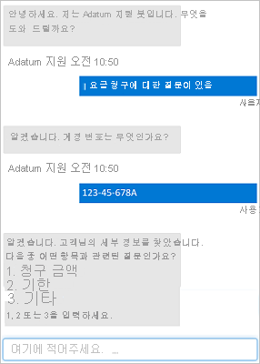

# 언어 서비스를 사용하여 질문 답변의 기본 사항

## 목차
- [언어 서비스를 사용하여 질문 답변의 기본 사항](#언어-서비스를-사용하여-질문-답변의-기본-사항)
  - [목차](#목차)
  - [소개](#소개)
  - [질문 답변 이해](#질문-답변-이해)
  - [언어 서비스 및 Azure Bot Service 시작](#언어-서비스-및-azure-bot-service-시작)
    - [사용자 지정 질문 답변 기술 자료 만들기](#사용자-지정-질문-답변-기술-자료-만들기)
      - [질문과 답변 정의](#질문과-답변-정의)
      - [프로젝트 테스트](#프로젝트-테스트)
    - [Azure AI Bot Service를 사용하여 봇 빌드](#azure-ai-bot-service를-사용하여-봇-빌드)
      - [채널 연결](#채널-연결)
  - [연습 - Language Studio에서 질문 답변 사용](#연습---language-studio에서-질문-답변-사용)
  - [요약](#요약)
  - [출처](#출처)

## 소개

우리는 전 세계 어느 곳에서나 낮이나 밤낮으로 의사 소통을 할 수 있어 조직이 고객에게 충분히 빠르게 반응해야 한다는 압박을 받고 있습니다. 답변을 찾기 위해 심층 설명서를 읽지 않고도 쿼리에 대한 개인적인 응답을 원합니다. 이것은 종종 지원 직원이 여러 채널을 통해 도움을 요청하는 오버로드되고 사람들이 응답을 기다리는 것을 의미합니다.

대화형 AI는 AI 에이전트와 사람 간의 대화를 가능하게 하는 솔루션을 설명합니다. 일반적으로 대화형 AI 에이전트를 봇이라고 합니다. 사람 웹 채팅 인터페이스, 이메일, 소셜 미디어 플랫폼 등의 채널을 통해 봇과 소통할 수 있습니다.

Azure AI Language의 질문 답변 기능은 대화형 AI 솔루션을 만드는 기능을 제공합니다. 다음으로 질문 답변에 대해 알아봅니다.

---
## 질문 답변 이해

질문 답변은 자동화된 대화 요소가 필요한 자연어 AI 워크로드를 지원합니다. 일반적으로 질문 답변은 고객 쿼리에 답변하는 봇 애플리케이션을 빌드하는 데 사용됩니다. 질문 답변 기능은 즉각적으로 답변하고, 우려 사항에 정확하게 답변하며, 상황이 자주 변하더라도 자연스럽게 사용자와 상호 작용할 수 있습니다. 봇은 웹 사이트나 소셜 미디어 플랫폼과 같은 다양한 플랫폼에서 구현될 수 있습니다.

질문 답변 애플리케이션은 사람들이 자신의 질문에 대한 답변을 가져올 수 있는 친근한 방법을 제공하고 근무 시간이 아닌 자신에게 맞는 시간에 질문을 처리할 수 있도록 해줍니다.

다음 예에서 챗봇은 자연어를 사용하고 고객에게 쿼리를 가장 잘 처리할 수 있는 옵션을 제공합니다. 사용자는 질문에 대한 답변을 빠르게 얻고, 쿼리가 복잡한 경우에는 사람에게 전달하기만 합니다.



다음으로, Azure AI 서비스를 사용하여 질문 답변 프로젝트를 만드는 방법을 알아봅니다.

---
## 언어 서비스 및 Azure Bot Service 시작

다음 두 가지 핵심 서비스를 조합하여 Microsoft Azure에서 사용자 지원 봇 솔루션을 쉽게 만들 수 있습니다.

 - Azure AI Language: 자연어 입력을 사용하여 쿼리할 수 있는 질문 및 답변 쌍의 기술 자료를 만들 수 있는 사용자 지정 질문 답변 기능이 포함되어 있습니다.
 - Azure AI Bot Service: Azure에서 봇을 개발, 게시 및 관리하기 위한 프레임워크를 제공합니다.

### 사용자 지정 질문 답변 기술 자료 만들기
Azure AI 언어 스튜디오를 사용하여 질문 답변 프로젝트를 만들기, 학습, 게시 및 관리할 수 있습니다.

참고
```
Azure AI 언어 REST API 또는 SDK를 사용하여 프로젝트를 만들고 관리하는 코드를 작성할 수 있습니다. 그러나 대부분의 시나리오에서는 Language Studio를 사용하는 것이 더 쉽습니다.
```
프로젝트를 만들려면 먼저 Azure 구독에서 언어 리소스를 프로비전해야 합니다.

#### 질문과 답변 정의

언어 리소스를 프로비전한 후 Language Studio의 사용자 지정 질문 답변 기능을 사용하여 질문과 답변 쌍으로 구성된 프로젝트를 만들 수 있습니다. 이러한 질문과 답변은 다음과 같을 수 있습니다.

 - 기존 FAQ 문서 또는 웹 페이지에서 생성합니다.
 - 수동으로 입력하고 편집합니다.

많은 경우에 위의 모든 기술을 조합해서 프로젝트를 만듭니다. 기존 FAQ 문서의 질문과 답변의 기본 데이터 세트부터 시작하여 추가 수동 입력 항목으로 기술 자료를 확장합니다.

프로젝트의 질문에 대체 문구를 할당하여 동일한 의미로 질문을 통합할 수 있습니다. 예를 들어 다음과 같은 질문을 포함할 수 있습니다.

```
‘본사 위치는 어디입니까?’
```
다음과 같은 대체 어구를 추가하여 이 질문이 가능한 다양한 방법을 예측할 수 있습니다.
```
‘본사는 어디에 위치합니까?’
```

#### 프로젝트 테스트

질문 및 답변 쌍의 집합을 만든 후에는 저장해야 합니다. 이 프로세스는 문자 그대로의 질문과 답변을 분석하고 기본 제공 자연어 처리 모델을 적용하여 질문의 정의에 명시된 정확한 문구가 아닌 경우에도 질문에 대해 적절한 답변을 매칭합니다. 그런 후 Language Studio의 기본 제공 테스트 인터페이스를 사용하여 질문을 제출하고 반환되는 답변을 검토하여 기술 자료를 테스트할 수 있습니다.

### Azure AI Bot Service를 사용하여 봇 빌드

기술 자료를 만들고 배포한 후 봇을 통해 사용자에게 제공할 수 있습니다. Microsoft Bot Framework SDK를 사용하여 대화 흐름을 제어하고 기술 자료와 통합하는 코드를 작성하면 사용자 지정 봇을 만들 수 있습니다. 그러나 더 쉬운 방법은 자동 봇 생성 기능을 사용하여 게시된 기술 자료용 봇을 만들고 몇 번의 클릭만으로 Azure AI Bot Service 애플리케이션으로 배포하는 것입니다.

#### 채널 연결

봇을 사용자에게 제공할 준비가 되면 여러 ‘채널’에 연결할 수 있으므로 사용자가 웹 채팅, 메일, Microsoft Teams 및 기타 공통 커뮤니케이션 미디어를 통해 봇과 상호 작용할 수 있습니다.


사용자는 채널을 통해 봇에 질문을 제출하고 봇의 기반이 되는 기술 자료에서 적절한 답변을 받을 수 있습니다.

---
## 연습 - Language Studio에서 질문 답변 사용
Azure에 구독한 경우 Language Studio를 사용하여 Azure AI 언어의 질문 답변 기능을 탐색할 수 있습니다.

TODO : 실습자료 만들기

---
## 요약

Azure AI 언어의 사용자 지정 질문 답변 기능을 사용하면 자연어 쿼리를 지원하는 질문 및 답변의 기술 자료를 정의하고 게시할 수 있습니다. Azure AI Bot Service와 결합하면 기술 자료를 사용하여 여러 통신 채널을 통해 사용자 질문에 지능적으로 응답하는 봇을 제공할 수 있습니다.

이러한 서비스로 대화식 AI 솔루션을 만드는 기능을 통해 AI 에이전트가 인적 자원의 지원 작업량을 줄여주고, 조직에서 글로벌 규모의 사용자 지원을 제공할 수 있도록 해줍니다.

---
## 출처
[Microsoft learn 언어 서비스를 사용하여 질문 답변의 기본 사항](https://learn.microsoft.com/ko-kr/training/modules/build-faq-chatbot-qna-maker-azure-bot-service/)