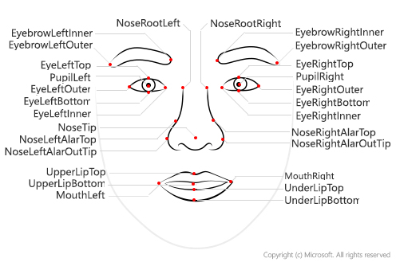

# 얼굴 인식의 기본 사항

## 목차
- [얼굴 인식의 기본 사항](#얼굴-인식의-기본-사항)
  - [목차](#목차)
  - [소개](#소개)
    - [얼굴 감지 및 분석의 용도](#얼굴-감지-및-분석의-용도)
  - [얼굴 분석 이해](#얼굴-분석-이해)
    - [얼굴 인식](#얼굴-인식)
  - [Azure의 Face 분석 시작하기](#azure의-face-분석-시작하기)
    - [Face 서비스](#face-서비스)
    - [책임 있는 AI 사용](#책임-있는-ai-사용)
    - [Face용 Azure 리소스](#face용-azure-리소스)
    - [보다 정확한 결과를 얻기 위한 팁](#보다-정확한-결과를-얻기-위한-팁)
  - [연습 - Vision Studio에서 얼굴 검색](#연습---vision-studio에서-얼굴-검색)
  - [TODO : 실습자료 만들기](#todo--실습자료-만들기)
  - [요약](#요약)
    - [정리](#정리)
  - [출처](#출처)

## 소개

얼굴 감지 및 분석은 알고리즘을 사용하여 이미지 또는 비디오 콘텐츠에서 사람의 얼굴을 찾고 분석하는 AI(인공 지능) 영역 중 하나입니다.

### 얼굴 감지 및 분석의 용도

얼굴 감지, 분석 및 인식은 다양한 응용 분야에서 활용됩니다. 예를 들면 다음과 같습니다.

 - 보안 - 얼굴 인식은 보안 애플리케이션을 빌드하는 데 사용할 수 있으며, 스마트폰 운영 체제에서 디바이스 잠금을 해제하기 위한 용도로 점점 더 보급화되고 있습니다.
 - 소셜 미디어 - 얼굴 인식을 사용하여 사진에서 알려진 친구를 자동으로 태그 지정할 수 있습니다.
 - 지능형 모니터링 - 운전자가 도로를 보고 있는지, 모바일 디바이스를 보고 있는지 아니면 피로의 징후를 보이는지 알아보기 위해 운전자의 얼굴을 모니터링하는 시스템이 자동차에 포함될 수 있습니다.
 - 광고 - 이미지에서 얼굴을 분석하여 적절한 인구 통계학적 대상 그룹에 광고를 직접 전달할 수 있습니다.
 - 실종자 - 공공 카메라 시스템과 얼굴 인식을 사용하여 실종자가 이미지 프레임에 있는지 식별할 수 있습니다.
 - 신원 확인 - 특별 입국 허가서를 소유하고 있는지 파악해야 하는 입국 키오스크 창구에서 유용합니다.
 - 
---
## 얼굴 분석 이해

얼굴 감지에는 다음과 같이 일반적으로 얼굴 주위에 사각형을 형성하는 경계 상자 좌표를 반환하여 사람의 얼굴을 포함하는 이미지 영역을 식별하는 작업이 포함됩니다.


얼굴 분석을 사용하면 얼굴 특징을 사용하여 코, 눈, 눈썹, 입술 등의 얼굴 특징과 같은 다른 정보를 반환하도록 기계 학습 모델을 학습시킬 수 있습니다.



### 얼굴 인식

얼굴 분석의 또 한 가지 응용 분야는 얼굴 특징에서 알려진 개인을 식별하도록 기계 학습 모델을 학습시키는 것입니다. 이를 얼굴 인식이라고하며, 개인의 여러 이미지를 사용하여 모델을 학습합니다. 이렇게 하면 모델이 학습되지 않은 새 이미지에서 해당 개인을 감지할 수 있도록 모델을 학습합니다.


책임 있게 사용하는 경우 얼굴 인식은 효율성, 보안, 고객 환경을 향상시킬 수 있는 중요하고 유용한 기술입니다. 다음으로 얼굴을 감지, 인식 및 분석하기 위해 미리 학습된 모델을 제공하는 Azure AI Face 서비스를 살펴보겠습니다.

---
## Azure의 Face 분석 시작하기

Microsoft Azure는 다음을 포함하여 얼굴을 감지하고 분석하는 데 사용할 수 있는 여러 Azure AI 서비스를 제공합니다.

 - Azure AI 비전은 이미지 주위에 경계 상자 좌표를 반환하는 등 얼굴 감지와 몇 가지 기본 얼굴 분석을 제공합니다.
 - Azure AI Video Indexer는 동영상에서 얼굴을 감지하고 식별하는 데 사용할 수 있습니다.
 - 얼굴을 감지, 인식, 분석할 수 있는 사전 구축된 알고리즘을 제공하는 Azure AI Face.

이 중 Face는 가장 폭넓은 얼굴 분석 기능을 제공합니다.

### Face 서비스

Azure Face 서비스는 이미지에서 발견된 사람 얼굴의 직사각형 좌표뿐만 아니라 다음과 같이 해당 얼굴과 관련된 일련의 특성을 반환할 수 있습니다.

 - 액세서리: 지정된 얼굴에 액세서리가 있는지 여부를 나타냅니다. 이 특성은 함께 모자, 안경 및 마스크 등의 액세서리를 각각 0~1의 신뢰도 점수와 함께 반환합니다.
 - 흐림: 얼굴의 흐릿한 정도로, 이미지의 중심 초점이 얼굴에 있을 가능성의 정도를 보여줄 수 있습니다.
 - 노출: 이미지가 노출 부족인지 과다 노출인지 여부를 나타냅니다. 이는 전체 이미지 노출이 아닌 이미지의 얼굴에 적용됩니다.
 - 안경: 인물이 안경을 쓰고 있는지 여부를 나타냅니다.
 - 머리 자세: 3차원 공간에서의 얼굴 방향입니다.
 - 마스크: 얼굴의 마스크 착용 여부를 나타냅니다.
 - 노이즈: 이미지상 시각적 노이즈를 의미합니다. 어두운 설정을 위해 높은 ISO 설정으로 사진을 촬영한 경우 이미지에 노이즈가 보일 것입니다. 이미지가 거칠어 보이거나 명확성이 떨어지는 작은 점들로 이루어진 것처럼 보입니다.
 - 가림: 이미지에서 얼굴을 가리는 요소가 있는지 확인합니다.

### 책임 있는 AI 사용
```
Azure AI Face 및 Azure AI 비전은 Microsoft의 책임 있는 AI 표준을 지원하기 위해 제한된 액세스 정책을 적용합니다.
```

누구나 Face 서비스를 사용하여 다음 작업을 수행할 수 있습니다.

 - 이미지에서 얼굴의 위치를 감지합니다.
 - 사람이 안경을 쓰고 있는지 확인합니다.
 - 얼굴에 가림, 흐림, 노이즈 또는 과다/과소 노출이 있는지 확인합니다.
 - 이미지상 각 얼굴의 머리 자세 좌표를 반환합니다.

제한된 액세스 정책에 따라 고객은 다음을 포함한 추가 Azure AI Face 서비스 기능에 액세스하려면 접수 양식을 제출해야 합니다.

 - 얼굴의 유사성을 비교하는 기능입니다.
 - 이미지에서 유명인을 식별하는 기능입니다.

### Face용 Azure 리소스

Face 서비스를 사용하려면 Azure 구독에서 다음 유형의 리소스 중 하나를 만들어야 합니다.

 - Face: 다른 Azure AI 서비스를 사용하지 않거나 Face의 사용률과 비용을 별도로 추적하려는 경우 이 특정 리소스 유형을 사용합니다.
 - Azure AI 서비스: Azure AI Face와 더불어 Azure AI 콘텐츠 보안, Azure AI 언어 등과 같은 다른 많은 Azure AI 서비스가 포함된 일반 리소스입니다. 여러 Azure AI 서비스를 사용하고 관리 및 개발을 간소화하려는 경우 이 리소스 유형을 사용하세요.

### 보다 정확한 결과를 얻기 위한 팁

이미지에서 감지의 정확도를 향상하는 데 도움이 되는 몇 가지 고려 사항이 있습니다.

 - 이미지 형식 - 지원되는 이미지는 JPEG, PNG, GIF 및 BMP입니다.
 - 파일 크기 - 6MB 이하.
 - 얼굴 크기 범위 - 36x36~4096x4096 픽셀. 범위보다 작거나 큰 얼굴은 감지되지 않습니다.
 - 기타 문제 - 얼굴 감지는 극단적인 얼굴 각도, 극단적인 조명, 가림(손과 같이 얼굴을 가리는 물체)으로 인해 제대로 작동하지 않을 수 있습니다.

---
## 연습 - Vision Studio에서 얼굴 검색

Azure를 구독하고 있는 경우 Vision Studio를 사용하여 Azure AI 비전의 기능을 탐색할 수 있습니다.


TODO : 실습자료 만들기
---
## 요약
Azure AI 비전과 Azure AI Video Indexer가 얼굴 감지 기능을 제공하지만, Face 서비스 및 관련 API는 더 많은 기능을 제공합니다. 무엇을 선택할지는 얼굴 감지로부터 어떤 인사이트를 얻고자 하느냐에 달려 있습니다. 얼굴 랜드마크 데이터를 찾으려는 경우 Face 리소스를 선택하는 것이 가장 좋습니다.

Face 서비스에 대한 자세한 내용은 서비스 문서에서 확인할 수 있습니다.

### 정리

프로젝트가 끝날 때 여기에서 만든 리소스가 계속 필요한지 결정하는 것이 좋습니다. 계속 실행되는 리소스에는 요금이 부과될 수 있습니다.

이 학습 경로의 다른 모듈을 계속 진행하려는 경우 다른 연습에서 사용하기 위해 리소스를 유지할 수 있습니다.

학습을 완료한 경우 Azure 구독에서 리소스 그룹이나 개별 리소스를 삭제할 수 있습니다.

 1. Azure 포털의 리소스 그룹 페이지에서 리소스를 만들 때 지정한 리소스 그룹을 엽니다.

 2. 리소스 그룹 삭제를 클릭하고 삭제하고자 하는 리소스 그룹 이름을 입력한 다음 삭제를 선택합니다. 리소스를 선택하고 점 세 개를 클릭해 추가 옵션을 표시한 후 삭제하여 개별 리소스를 삭제하도록 선택할 수도 있습니다.

---
## 출처
[Microsoft learn 얼굴 인식의 기본 사항](https://learn.microsoft.com/ko-kr/training/modules/detect-analyze-faces/)