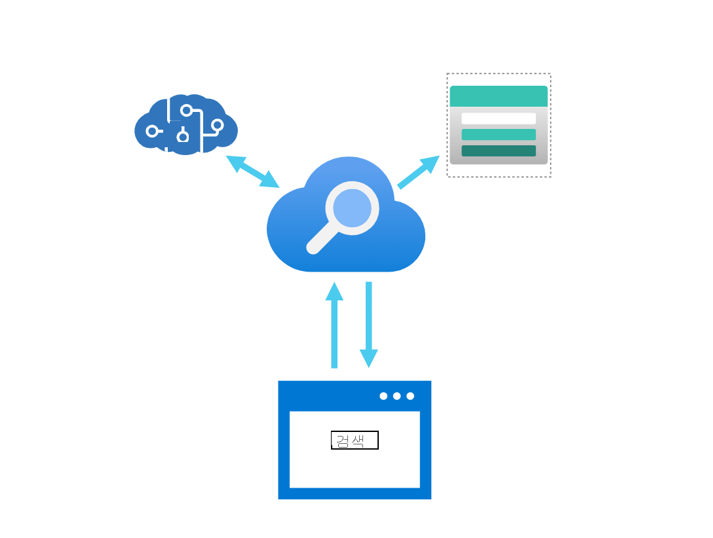
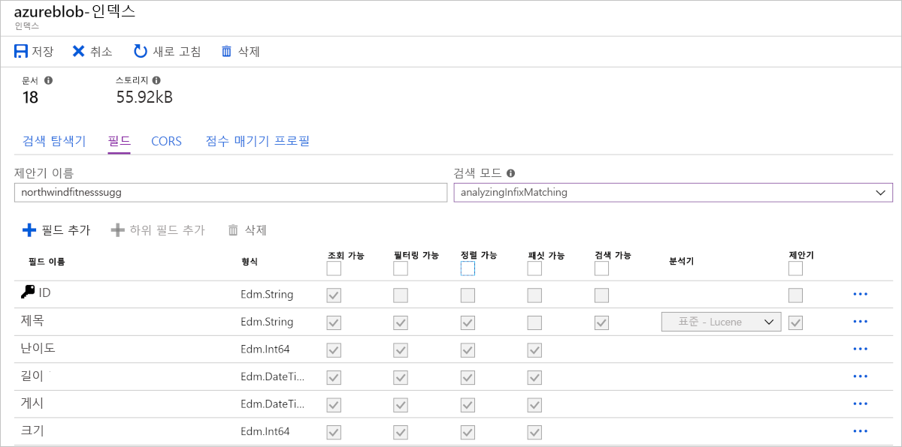
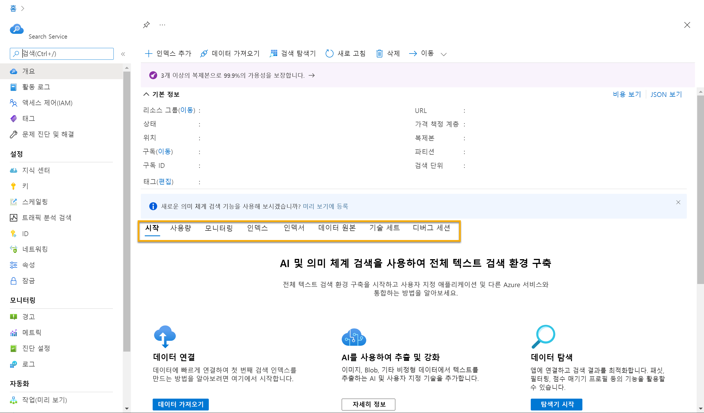

# 지식 마이닝 및 Azure AI 검색의 기본 사항

## 목차
- [지식 마이닝 및 Azure AI 검색의 기본 사항](#지식-마이닝-및-azure-ai-검색의-기본-사항)
  - [목차](#목차)
  - [소개](#소개)
    - [학습목표](#학습목표)
  - [Azure AI 검색이란?](#azure-ai-검색이란)
    - [Azure AI 검색 기능](#azure-ai-검색-기능)
  - [검색 솔루션의 요소 확인](#검색-솔루션의-요소-확인)
  - [기술 세트를 사용하여 보강 파이프라인 정의](#기술-세트를-사용하여-보강-파이프라인-정의)
    - [기본 제공 기술](#기본-제공-기술)
  - [인덱스 이해](#인덱스-이해)
    - [인덱스 스키마](#인덱스-스키마)
    - [인덱스 특성](#인덱스-특성)
  - [인덱서를 사용하여 인덱스 빌드](#인덱서를-사용하여-인덱스-빌드)
    - [데이터 가져오기 모니터링 및 확인](#데이터-가져오기-모니터링-및-확인)
    - [인덱스 변경](#인덱스-변경)
  - [지식 저장소에 보강된 데이터 저장](#지식-저장소에-보강된-데이터-저장)
  - [Azure Portal에서 인덱스 만들기](#azure-portal에서-인덱스-만들기)
    - [Azure Portal의 데이터 가져오기 마법사 사용](#azure-portal의-데이터-가져오기-마법사-사용)
  - [Azure AI 검색 인덱스의 데이터 쿼리](#azure-ai-검색-인덱스의-데이터-쿼리)
    - [간단한 쿼리 요청](#간단한-쿼리-요청)
  - [연습 - Azure AI 검색 인덱스(UI) 탐색](#연습---azure-ai-검색-인덱스ui-탐색)
  - [요약](#요약)
  - [출처](#출처)


---
## 소개
온라인에서 정보를 검색하는 것이 더 쉬워졌습니다. 그러나 검색 인덱스가 아닌 문서에서 정보를 찾는 것은 여전히 어려운 일입니다. 예를 들어, 매일 사람들은 구조화되지 않은 문서, 형식화된 이미지 기반 또는 손으로 쓴 문서를 처리합니다. 종종 이러한 문서를 직접 읽어 찾은 데이터를 유지하기 위해 인사이트를 추출하고 기록해야 합니다. 이제 정보 추출을 자동화할 수 있는 솔루션이 있습니다.

지식 마이닝은 종종 대량의 비정형 데이터에서 정보를 추출하는 솔루션을 설명하는 데 사용되는 용어입니다. 이러한 지식 마이닝 솔루션 중 하나는 사용자 관리 인덱스 작성을 위한 도구가 있는 클라우드 검색 서비스인 Azure AI 검색입니다. 그런 다음, 인덱스는 내부 전용으로 사용하거나 공개 인터넷 자산에서 검색 가능한 콘텐츠를 활성화하는 데 사용할 수 있습니다.

중요하게도, Azure AI 검색은 이미지 처리, 콘텐츠 추출 및 자연어 처리와 같은 Azure AI 서비스의 기본 제공 기능을 활용하여 문서 지식 마이닝을 수행할 수 있습니다. 제품의 AI 기능을 사용하면 이전에 검색할 수 없었던 문서를 인덱싱하고 대량의 데이터에서 신속하게 인사이트를 추출하고 노출할 수 있습니다.

### 학습목표

이 모듈에서는 다음을 수행합니다.

 - Azure AI 검색에서 인식 기술을 사용하는 방법 이해
 - 인덱서가 JSON serialization을 포함하여 데이터 수집 단계를 자동화하는 방법 알아보기
 - 지식 저장소의 용도 설명
 - 검색 인덱스 빌드 및 쿼리

---
## Azure AI 검색이란?

Azure AI Search는 다양한 구조적, 반구조적 및 비구조적 문서에서 데이터를 추출하는 검색 솔루션을 만들기 위한 인프라와 도구를 제공합니다.



Azure AI Search 결과에는 데이터만 포함되며, 여기에는 이미지에서 유추되거나 추출된 텍스트 또는 텍스트 분석을 통한 새 엔터티 및 핵심 문구 검색이 포함될 수 있습니다. PaaS(Platform as a Service) 솔루션입니다. 이는 Microsoft에서 인프라와 가용성을 관리하여 전용 하드웨어 리소스를 구입하거나 관리할 필요 없이 조직에서 이점을 활용할 수 있습니다.

### Azure AI 검색 기능

Azure AI Search는 기존 기술을 보완하기 위해 존재하며 오픈 소스 소프트웨어 라이브러리인 Apache Lucene을 기반으로 한 프로그램 가능한 검색 엔진을 제공합니다. 이는 클라우드 및 온-프레미스 자산에 99.9% 가동 시간 SLA를 제공하는 고가용성 플랫폼입니다.

Azure AI 검색에는 다음 기능이 제공됩니다.

 - 모든 원본의 데이터: Azure에서 선택한 데이터 원본에 대한 자동 크롤링 지원을 통해 JSON 형식으로 제공된 모든 원본의 데이터를 허용합니다.
 - 전체 텍스트 검색 및 분석: 단순 쿼리와 전체 Lucene 쿼리 구문을 모두 지원하는 전체 텍스트 검색 기능을 제공합니다.
 - AI 기반 검색: 원시 콘텐츠의 이미지 및 텍스트 분석을 위해 Azure AI 기능이 기본 제공되어 있습니다.
 - 다국어는 56개 언어에 대한 언어 분석을 제공하여 음성 일치 또는 언어별 언어학을 지능적으로 처리합니다. Azure AI 검색에서 사용할 수 있는 자연어 프로세서는 Bing 및 Office에서도 사용됩니다.
 - 지역 기반: 실제 위치와의 근접성을 기반으로 지역 검색 필터링을 지원합니다.
 - 구성 가능한 사용자 환경: 자동 완성, 자동 제안, 페이지 매김, 방문 항목 강조 표시 등 사용자 환경을 개선하는 여러 기능이 있습니다.

---
## 검색 솔루션의 요소 확인


일반적인 Azure AI 검색 솔루션은 검색하려는 데이터 아티팩트가 포함된 데이터 원본으로 시작됩니다. 이는 Azure Storage의 폴더 및 파일의 계층 구조이거나 Azure SQL Database 또는 Azure Cosmos DB와 같은 데이터베이스의 텍스트일 수 있습니다. Azure AI 검색이 지원하는 데이터 서식은 JSON입니다. 데이터 원본 위치에 관계없이 JSON 문서로 제공할 수 있는 경우 검색 엔진에서 데이터를 인덱싱할 수 있습니다.

데이터가 지원되는 데이터 원본에 있는 경우 인덱서로 원본 데이터의 JSON 직렬화를 비롯한 데이터 수집을 네이티브 형식으로 자동화할 수 있습니다. 인덱서는 데이터 원본에 연결하고, 데이터를 직렬화하고, 인덱싱을 위해 검색 엔진에 전달합니다. 대부분의 인덱서는 변경 검색을 지원하므로 데이터를 더 간단하게 새로 고칠 수 있습니다.

인덱서는 데이터 수집 자동화 외에도 AI 보강을 지원합니다. 일련의 AI 기술을 적용하는 기술 세트를 연결하여 데이터를 보강하여 더 쉽게 검색할 수 있습니다. Azure AI Services API를 기반으로 하는 포괄적인 기본 제공 기술 세트를 통해 텍스트에서 엔터티 인식, 텍스트 번역, 감정 평가 또는 이미지에 대한 적절한 캡션 예측과 같은 새로운 필드를 파생시킬 수 있습니다. 또한 보강된 콘텐츠를 지식 저장소로 보내 AI 보강 파이프라인의 출력을 독립적인 분석 또는 다운스트림 처리를 위해 Azure Storage의 테이블 및 Blob에 저장할 수 있습니다.

데이터를 인덱스에 푸시하는 애플리케이션 코드를 작성하든, 데이터 수집을 자동화하고 AI 보강을 추가하는 인덱서를 사용하든, 콘텐츠가 포함된 필드는 클라이언트 애플리케이션에서 검색할 수 있는 인덱스에 유지됩니다. 필드는 검색, 필터링 및 정렬에 사용되어 클라이언트 애플리케이션에서 표시하거나 사용할 수 있는 결과 집합을 생성합니다.

---
## 기술 세트를 사용하여 보강 파이프라인 정의

AI 보강은 전체 텍스트 검색을 위해 인덱싱할 수 없는 콘텐츠에서 텍스트 및 정보를 추출하는 파이프라인에 포함된 이미지 및 자연어 처리를 나타냅니다.

AI 처리는 기술 세트에 기술을 추가하고 결합함으로써 이루어집니다. 기술 세트는 검색 가능하도록 데이터를 추출하고 보강하는 작업을 정의합니다. 이러한 AI 기술은 텍스트 번역이나 OCR(광학 문자 인식)과 같은 기본 제공 기술이나 사용자가 제공하는 사용자 지정 기술일 수 있습니다.

### 기본 제공 기술

기본 제공 기술은 Microsoft에서 미리 학습된 모델을 기반으로 하기 때문에 사용자 고유의 학습 데이터를 사용하여 모델을 학습시킬 수 없습니다. Azure AI 서비스 API를 호출하는 기술은 해당 서비스에 대한 종속성을 가지며 리소스를 연결할 때 Azure AI 서비스 종량제 가격으로 청구됩니다. 다른 기술은 Azure AI 검색에 의해 계량되거나 무료로 사용할 수 있는 유틸리티 기술입니다.

기본 제공 기술은 다음과 같은 범주로 분류됩니다.

자연어 처리 기술: 이러한 기술로 비구조적 텍스트는 인덱스에서 검색 및 필터링 가능한 필드로 매핑됩니다.

일부 사례:

 - 핵심 구 추출: 미리 학습된 모델을 사용하여 용어 배치, 언어 규칙, 다른 용어에 대한 근접성 및 원본 데이터 내에서 용어가 비정상적인 정도에 따라 중요한 구를 검색합니다.

 - 텍스트 번역 기술: 미리 학습된 모델을 사용하여 정규화 또는 지역화 사용 사례를 위해 입력 텍스트를 다양한 언어로 번역합니다.

이미지 처리 기술: 이미지 콘텐츠의 텍스트 표현을 만들어 Azure AI 검색의 쿼리 기능을 사용하여 검색할 수 있도록 합니다.

일부 사례:

 - 이미지 분석 기술: 이미지 검색 알고리즘을 사용하여 이미지의 콘텐츠를 식별하고 텍스트 설명을 생성합니다.

 - OCR(광학 문자 인식) 기술: 문서송장, 청구서, 재무 보고서, 문서 등과 함께 도로 표지판 및 제품 사진과 같은 이미지에서 인쇄되거나 필기된 텍스트를 추출할 수 있습니다.

---
## 인덱스 이해
Azure AI 검색 인덱스는 검색할 수 있는 문서의 컨테이너로 간주될 수 있습니다. 개념적으로 인덱스를 테이블로 생각할 수 있으며 테이블의 각 행은 문서를 나타냅니다. 테이블에는 열이 있으며, 이 열은 문서의 필드와 동일한 것으로 간주될 수 있습니다. 필드가 문서에서 수행하는 것과 마찬가지로 열에는 데이터 형식이 있습니다.

### 인덱스 스키마
Azure AI 검색에서 인덱스는 검색 기능을 활성화하는 데 사용되는 JSON 문서 및 다른 콘텐츠의 영구 컬렉션입니다. 인덱스 내의 문서는 테이블의 행으로 간주할 수 있으며, 각 문서는 인덱스에서 검색 가능한 데이터의 단일 단위입니다.

인덱스에는 스키마라는 이러한 문서의 데이터 구조에 대한 정의가 포함됩니다. AI 추출 필드 keyphrases 및 imageTags가 있는 색인 스키마의 예는 다음과 같습니다.


### 인덱스 특성

Azure AI 검색은 사용자가 문서에서 어떻게 필드를 검색하고 표시하려는지를 알아야 합니다. 이러한 필드에 속성 또는 동작을 할당하여 지정합니다. 문서의 각 필드에 대해 인덱스는 이름, 데이터 형식 및 필드에 대해 지원되는 동작(예: 필드를 검색할 수 있는지, 필드를 정렬할 수 있는지 여부)을 저장합니다.

가장 효율적인 인덱스는 필요한 동작만 사용합니다. 디자인할 때 필드에서 필요한 동작을 설정하는 것을 잊어버린 경우 해당 기능을 얻는 유일한 방법은 인덱스를 다시 작성하는 것입니다.

다음 이미지는 Azure에서 인덱스를 디자인할 때의 필드를 보여줍니다.



---
## 인덱서를 사용하여 인덱스 빌드
Azure Storage에서 문서를 인덱싱하려면 원본 파일 형식에서 JSON으로 내보내야 합니다. 모든 형식의 데이터를 JSON으로 내보내고 인덱스로 로드하기 위해 인덱서를 사용합니다.

검색 문서를 만들려면 애플리케이션 코드로 JSON 문서를 생성하거나 Azure의 인덱서를 사용하여 들어오는 문서를 JSON으로 내보낼 수 있습니다.

Azure AI 검색을 사용하면 다음 두 가지 방식을 통해 JSON 문서를 만들고 인덱스에 로드할 수 있습니다.

 - Push 메서드: JSON 데이터는 REST API 또는 .NET SDK를 통해 검색 인덱스로 푸시됩니다. 데이터 원본 유형, 위치 또는 실행 빈도에 제한이 없으므로 데이터 푸시가 가장 유연합니다.

 - Pull 메서드: 검색 서비스 인덱서는 인기 있는 Azure 데이터 원본에서 데이터를 끌어올 수 있으며, 필요한 경우 해당 형식이 아직 없는 경우 해당 데이터를 JSON으로 내보냅니다.

### 데이터 가져오기 모니터링 및 확인
Search 서비스 개요 페이지에는 검색 서비스의 상태를 빠르게 확인할 수 있는 대시보드가 있습니다. 대시보드에서는 검색 서비스에 있는 문서의 수, 사용한 인덱스 수 및 사용 중인 스토리지의 양을 확인할 수 있습니다.

새 문서를 인덱스에 로드할 때 인덱스와 연결된 인덱서를 클릭하여 진행 상황을 모니터링할 수 있습니다. 문서가 인덱스에 로드되면 문서 수가 증가합니다. 경우에 따라 포털 페이지에서 최신 문서 수를 표시하는 데 몇 분 정도 걸릴 수 있습니다. 인덱스를 쿼리할 준비가 되면 Search 탐색기를 사용하여 결과를 확인할 수 있습니다. 첫 번째 문서가 성공적으로 로드되면 인덱스가 준비됩니다.

인덱서는 새 문서 또는 업데이트된 문서만 가져오므로 일반적으로 0개의 인덱싱된 문서가 표시됩니다.

Search 탐색기는 빠른 검색을 수행하여 인덱스의 콘텐츠를 확인하고 예상된 검색 결과를 가져오도록 할 수 있습니다. 포털에서 이 도구를 사용하면 JSON 문서로 반환된 결과를 검토하여 인덱스를 쉽게 확인할 수 있습니다.

### 인덱스 변경
필드 정의를 변경해야 하는 경우 인덱스를 삭제하고 다시 만들어야 합니다. 모든 기존 문서에 null 값이 있는 새 필드를 추가할 수 있도록 지원합니다. 포털에서 작업하려면 인덱스를 삭제하고, 다시 만들고, 스키마 세부 정보를 수동으로 작성해야 하므로 디자인을 반복하는 코드 기반 방법을 사용하는 것이 더 빠릅니다.

사용자에게 영향을 주지 않고 인덱스를 업데이트하는 방법은 다른 이름으로 새로운 인덱스를 만드는 것입니다. 동일한 인덱서 및 데이터 원본을 사용할 수 있습니다. 데이터를 가져온 후 새 인덱스를 사용하도록 앱을 전환할 수 있습니다.

---
## 지식 저장소에 보강된 데이터 저장
지식 저장소는 보강된 콘텐츠의 영구 스토리지입니다. 지식 저장소의 목적은 AI 보강에서 생성된 데이터를 컨테이너에 저장하는 것입니다. 예를 들어, 이미지에서 캡션을 생성하는 AI 기술 세트의 결과를 저장할 수 있습니다.


기술 세트는 엔터티 인식 또는 텍스트 번역과 같은 변환을 호출하는 강화 시퀀스를 통해 문서를 이동한다는 점을 기억하세요. 결과는 검색 인덱스이거나 지식 저장소의 프로젝션일 수 있습니다. 검색 인덱스와 지식 저장소의 두 출력은 동일한 파이프라인의 상호 배타적 제품입니다. 동일한 입력에서 파생되지만 다른 애플리케이션에서 구조화, 저장 및 사용되는 출력이 생성됩니다.

Azure AI Search 솔루션은 일반적으로 검색 가능한 인덱스를 만드는 것에 초점을 두지만, 데이터 추출 및 보강 기능을 활용하여 추가 분석 또는 처리를 위해 지식 저장소에 보강된 데이터를 유지할 수도 있습니다.

지식 저장소는 추출된 데이터의 세 가지 유형의 프로젝션 중 하나 이상을 포함할 수 있습니다.

 - 테이블 프로젝션은 쿼리 및 시각화를 위해 관계형 스키마에서 추출된 데이터를 구조화하는 데 사용됩니다.
 - 개체 프로젝션은 각 데이터 엔터티를 나타내는 JSON 문서입니다.
 - 파일 프로젝션은 추출된 이미지를 JPG 형식으로 저장하는 데 사용됩니다.

---
## Azure Portal에서 인덱스 만들기

인덱서로 인덱싱을 만들기 전에 먼저 지원되는 데이터 원본에서 데이터를 사용할 수 있도록 해야 합니다. 지원되는 데이터 원본은 다음과 같습니다.

 - Cosmos DB(SQL API)
 - Azure SQL(Azure VM의 Database, Managed Instance 및 SQL Server)
 - Azure Storage(Blob Storage, Table Storage, ADLS Gen2)

### Azure Portal의 데이터 가져오기 마법사 사용

데이터가 Azure 데이터 원본에 있으면 Azure AI 검색 사용을 시작할 수 있습니다. Azure Portal의 Azure AI 검색 서비스에 포함된 데이터 가져오기 마법사는 Azure Portal에서 프로세스를 자동화하여 검색 엔진에 필요한 다양한 개체를 만듭니다. Azure Portal을 사용하여 다음 개체를 만들 때 해당 개체가 작동하는 것을 볼 수 있습니다.

 - 데이터 원본: 자격 증명을 포함하여 원본 데이터에 대한 연결 정보를 유지합니다. 데이터 원본 개체는 인덱서에 독점적으로 사용됩니다.
 - 인덱스: 전체 텍스트 검색 및 기타 쿼리에 사용되는 물리적 데이터 구조입니다.
 - 인덱서: 데이터 원본, 대상 인덱스, 선택적 AI 기술 세트, 선택적 일정, 오류 처리 및 base-64 인코딩에 대한 선택적 구성 설정을 지정하는 구성 개체입니다.
 - 기술 세트: 이미지 파일에서 정보 분석 및 추출을 포함하여 콘텐츠를 조작, 변환 및 셰이핑하기 위한 전체 지침 집합입니다. 매우 간단하고 제한된 구조체를 제외하고 보강을 지원하는 Azure AI 서비스 리소스 참조가 포함됩니다.
 - 지식 저장소: AI 보강 파이프라인의 출력을 독립적인 분석 또는 다운스트림 처리를 위해 Azure Storage 테이블 및 Blob에 저장합니다.

Azure AI 검색을 사용하려면 Azure AI 검색 리소스가 필요합니다. Azure Portal에서 리소스를 만들 수 있습니다. 리소스가 만들어지면 포털의 리소스 개요 페이지에서 서비스의 구성 요소를 관리할 수 있습니다.



Azure Portal을 사용하거나 REST API 또는 SDK(소프트웨어 개발 키트)를 사용하여 프로그래밍 방식으로 Azure Search 인덱스를 빌드할 수 있습니다.

---
## Azure AI 검색 인덱스의 데이터 쿼리
인덱스와 쿼리 디자인은 밀접하게 연결되어 있습니다. 인덱스를 빌드한 후 쿼리를 수행할 수 있습니다. 이해해야 할 중요한 구성 요소는 인덱스의 스키마에서 응답할 수 있는 쿼리를 결정한다는 것입니다.

Azure AI 검색 쿼리는 HTTP 또는 REST API 요청으로 전송될 수 있으며 응답은 JSON으로 반환됩니다. 쿼리에서 검색 및 반환되는 필드, 검색 결과의 모양을 지정하는 방법, 결과를 필터링하거나 정렬하는 방법을 지정할 수 있습니다. 검색할 필드를 지정하지 않은 쿼리는 인덱스 내에서 검색할 수 있는 모든 필드에 대해 실행됩니다.

Azure AI 검색은 단순 Lucene와 전체 Lucene이라는 두 가지 유형의 구문을 지원합니다. 간단한 구문은 모든 일반적인 쿼리 시나리오를 다루지만, 전체 Lucene은 고급 시나리오에 유용합니다.

### 간단한 쿼리 요청
쿼리 요청은 결과 세트에 반환되도록 하려는 대상의 목록이나 단어(검색 용어) 및 쿼리 연산자(단순 또는 전체)입니다. 검색 쿼리를 구성하는 구성 요소를 살펴보겠습니다. 다음과 같은 간단한 검색 예를 들어 보겠습니다.

```
coffee (-"busy" + "wifi")
```

이 쿼리는 busy를 제외하고 wifi를 포함하여 커피에 대한 콘텐츠를 찾으려고 합니다.

쿼리를 구성 요소로 나누면 검색 용어(coffee)와 두 개의 축자 구문("busy", "wifi") 그리고 연산자(-, +, ( ))로 구성됩니다. 검색 용어는 콘텐츠의 순서 또는 위치에 관계없이 검색 인덱스에서 일치시킬 수 있습니다. 두 구는 지정된 것과 정확히 일치할 뿐이므로 wi-fi는 일치하지 않습니다. 마지막으로 쿼리에는 여러 연산자가 포함될 수 있습니다. 이 예제에서 - 연산자는 이러한 구가 결과에 있으면 안 된다고 검색 엔진에 지시합니다. 괄호는 용어를 그룹화하고 해당 우선 순위를 설정합니다.

기본적으로 검색 엔진은 쿼리의 용어 중 하나와는 일치시킵니다. coffee만 포함된 콘텐츠는 일치합니다. 이 예제에서 -"busy"를 사용하면 "busy" 문자열과 정확히 일치하지 않는 모든 콘텐츠를 포함한 검색 결과로 이어집니다.

Azure AI 검색의 단순 쿼리 구문은 전체 Lucene 쿼리 구문의 더 복잡한 기능 중 일부를 제외하며, 쿼리에 대한 기본 검색 구문입니다.

설명서에서 쿼리 구문에 대해 자세히 알아볼 수 있습니다.

---
## 연습 - Azure AI 검색 인덱스(UI) 탐색
이 연습에서는 고객 환경에 대한 인사이트를 쉽게 검색할 수 있는 지식 마이닝 솔루션을 빌드합니다.

TODO : 실습자료 만들기

---
## 요약
이 모듈에서는 Azure AI 검색을 사용하여 확장성 있는 풍부한 검색 환경을 만드는 이점을 살펴보았습니다.

---
## 출처
[Microsoft learn 지식 마이닝 및 Azure AI 검색의 기본 사항](https://learn.microsoft.com/ko-kr/training/modules/intro-to-azure-search/)