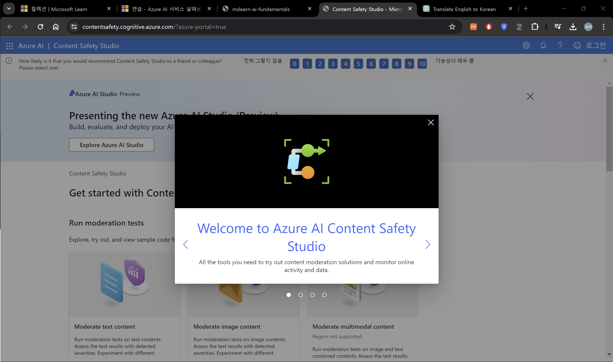
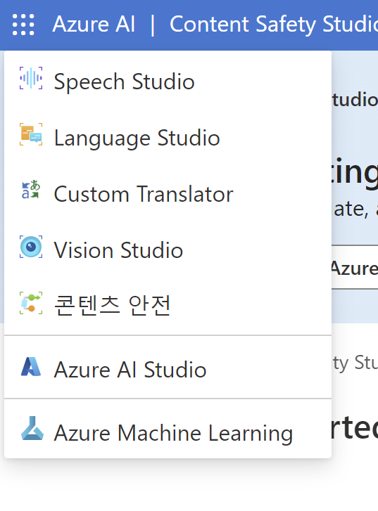
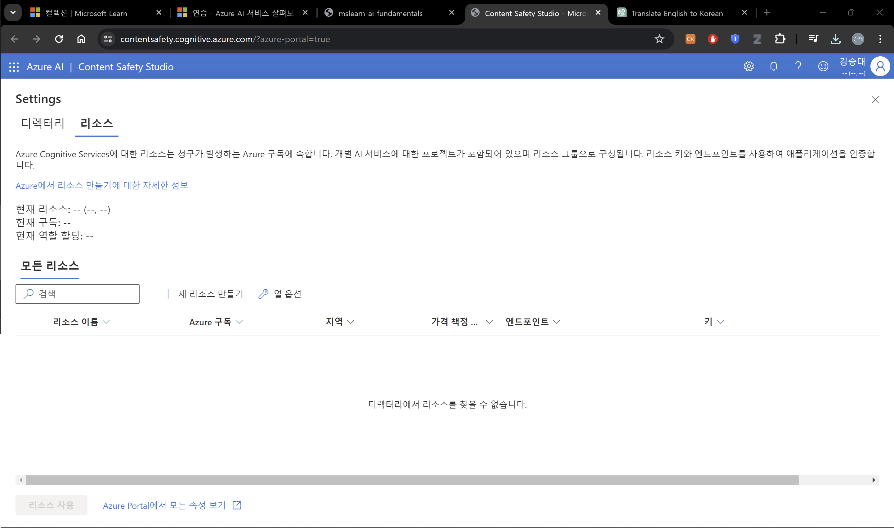
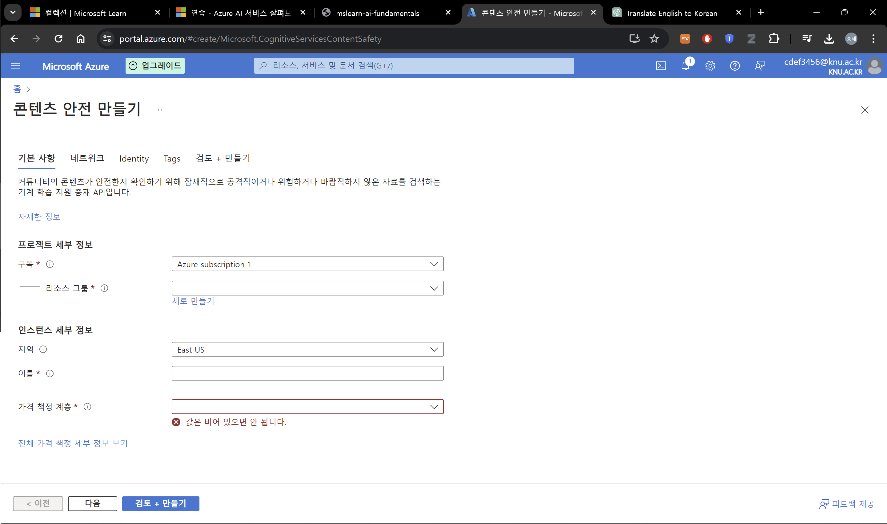
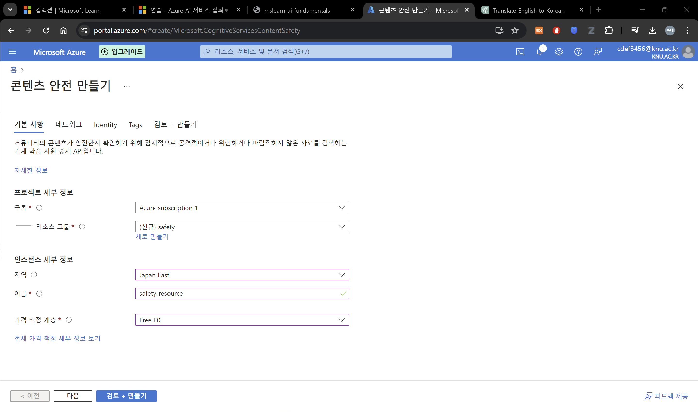
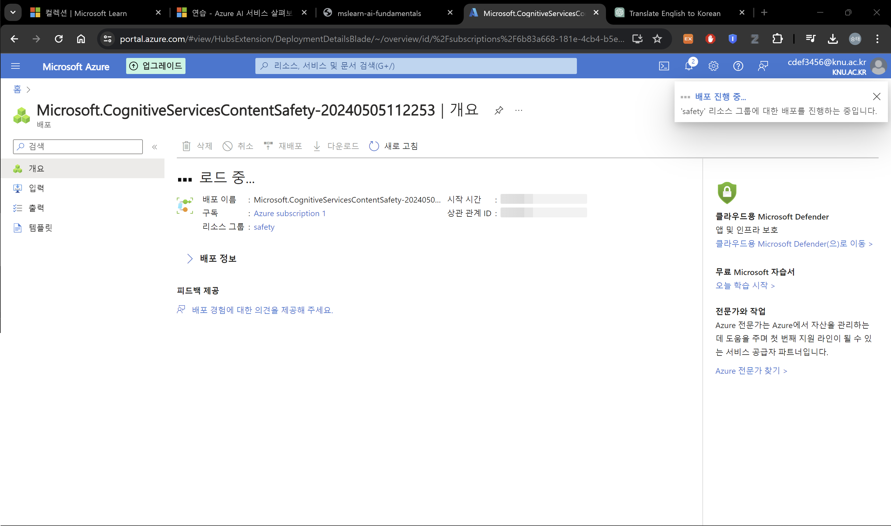
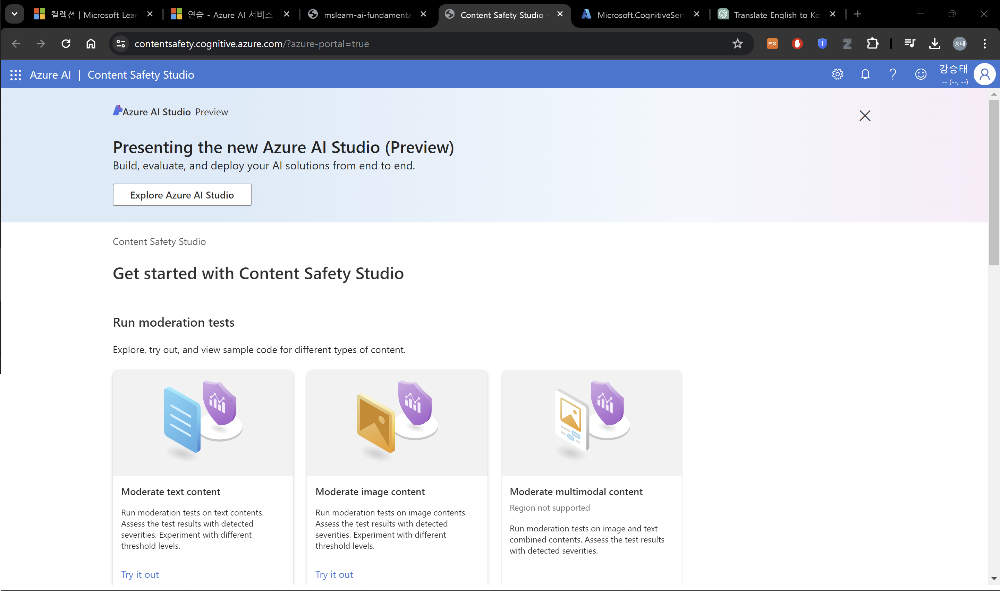

# Explore Azure AI Services

Azure AI Service는 사용자가 기본 제공되고 사전 빌드되고 사용자 정의 가능한 API 및 모델을 사용하여 AI 응용 프로그램을 생성하는 데 도움을 줍니다. 이 연습에서는 Content Safety Studio의 Azure AI Content Safety Service를 살펴볼 것입니다.

Content Safety Studio를 사용하면 텍스트 및 이미지 콘텐츠를 어떻게 조절할 수 있는지 살펴볼 수 있습니다. 샘플 텍스트나 이미지에서 테스트를 실행하고 각 카테고리에 대해 안전에서 높음까지 범위가 있는 심각도 점수를 받을 수 있습니다. 이 랩 연습에서는 Content Safety Studio에서 단일 서비스 리소스를 생성하고 해당 기능을 테스트할 것입니다.

Note
```
이 연습의 목표는 Azure AI 서비스가 어떻게 제공되고 사용되는지에 대한 일반적인 감각을 얻는 것입니다. Content Safety는 예시로 사용되지만, 이 연습에서 컨텐츠 안전에 대한 포괄적인 지식을 습득할 것으로 기대되지는 않습니다!
```

## Navigate the Content Safety Studio


 1. [Content Safety Studio](https://contentsafety.cognitive.azure.com/?azure-portal=true)를 여시오. <br> 
 2. Azure 구독이 있는 계정으로 로그인 하시오.
 3. Content Safety Studio는 Azure AI 서비스를 위한 다른 많은 스튜디오와 비슷한 방식으로 설정됩니다. 화면 상단의 메뉴에서 Azure AI 왼쪽에 있는 아이콘을 클릭하십시오. Azure AI 서비스 개발을 위해 설계된 다른 스튜디오의 드롭다운 목록이 표시됩니다. 목록을 숨기려면 아이콘을 다시 클릭할 수 있습니다. <br> 

## Associate a resource with the studio


스튜디오를 사용하기 전에 스튜디오와 Azure AI 서비스 리소스를 연결해야 합니다. 스튜디오에 따라 특정 단일 서비스 리소스가 필요한 경우도 있고 일반적인 다중 서비스 리소스를 사용할 수도 있습니다. Content Safety Studio의 경우, 단일 서비스 Content Safety 리소스 또는 Azure AI 서비스 일반 다중 서비스 리소스를 생성하여 서비스를 사용할 수 있습니다. 아래 단계에서는 단일 서비스 Content Safety 리소스를 생성할 것입니다.

 1. 화면 오른쪽 위의 **Settings** 버튼을 누르시오. <br>  <br> 
 2. **Settings** 페이지에서 디렉터리와 리소스 탭을 볼 수 있습니다. 리소스 탭에서 **새 리소스 만들기**를 클릭하시오. 이것은 Azure Portal로 이동하여 리소스를 만드는 페이지로 이동합니다. (다시 로그인 해달라고 할 시 같은 계정으로 로그인 하면 됩니다.) <br> 
 3. 리소스를 만들기 위해 다음과 같이 세팅하세요. <br> 
    - 구독: 구독
    - 리소스 그룹: 이름 겹치지 않게 새로 만들기
    - 지역: 가까운 곳
    - 이름: 이름 겹치지 않게 짓기
    - 가격 책정 계층 : Free F0
 4. **검토 + 만들기** > **만들기** <br> 

###############################
여기서 실패 남
{
    "status": "Failed",
    "error": {
        "code": "GatewayAuthenticationFailed",
        "message": "'Microsoft.ManagedIdentity'에 대한 게이트웨이 인증에 실패했습니다. 진단 정보: 타임스탬프 '20240505T023355Z', 추적 ID '7856c695-e71a-426b-9d4d-987a1260faca', 요청 상관 관계 ID 'c503bb31-03a6-48d0-8284-2581f50b7883'."
    }
}
###############################


축하합니다! 방금 Azure AI 서비스 리소스를 생성하거나 프로비저닝했습니다. 특별히 생성한 리소스는 단일 서비스 Content Safety 서비스 리소스입니다.

 5. 배포가 완료되면 새 탭을 열고 [Content Safety Studio](https://contentsafety.cognitive.azure.com/?azure-portal=true)로 돌아갑니다. <br> 
 6. 화면 오른쪽 상단에 있는 설정 아이콘을 다시 선택합니다. 이번에는 새로 생성된 리소스가 목록에 추가된 것을 확인할 수 있어야 합니다. 
 7. Content Safety Studio의 설정 페이지에서 방금 생성한 Azure AI 서비스 리소스를 선택하고 화면 아래쪽의 리소스 사용을 클릭합니다. 이제 스튜디오 홈 페이지로 돌아갈 것입니다. 이제 새로 생성한 리소스로 스튜디오를 사용할 수 있습니다.
  


## 출처
[Explore Azure AI Services](https://microsoftlearning.github.io/mslearn-ai-fundamentals/Instructions/Labs/02-content-safety.html)