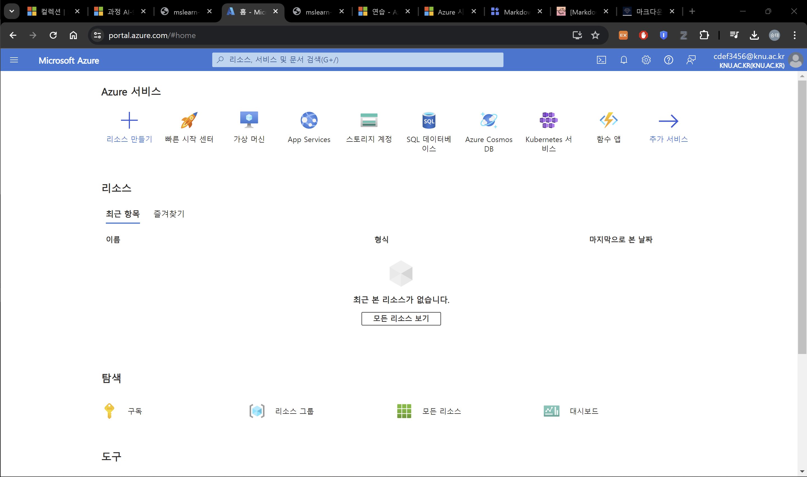
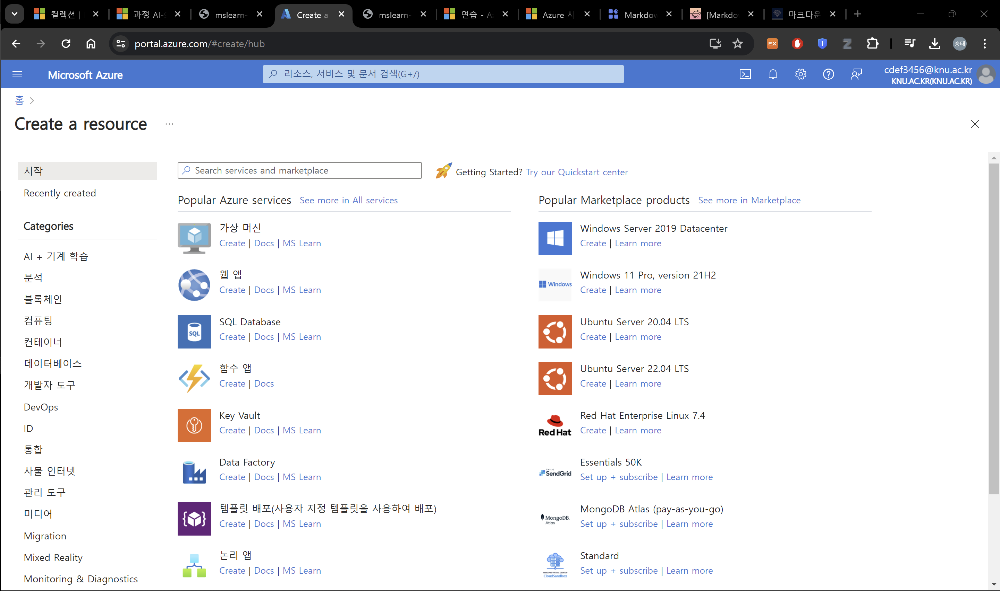
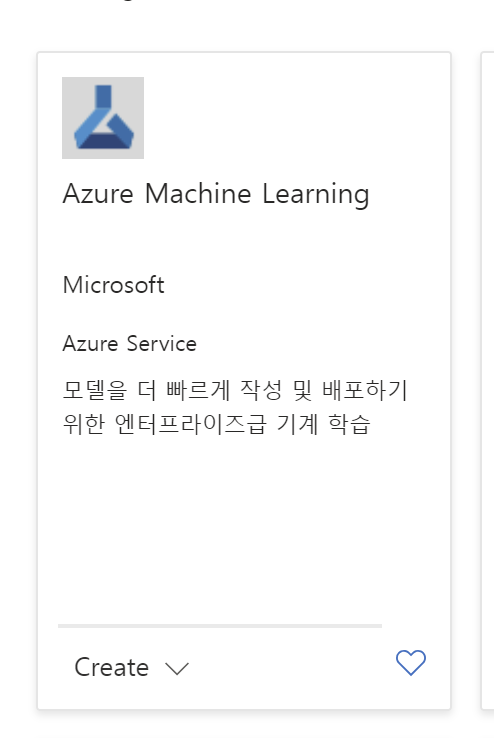
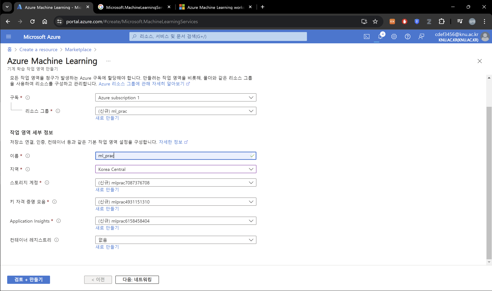
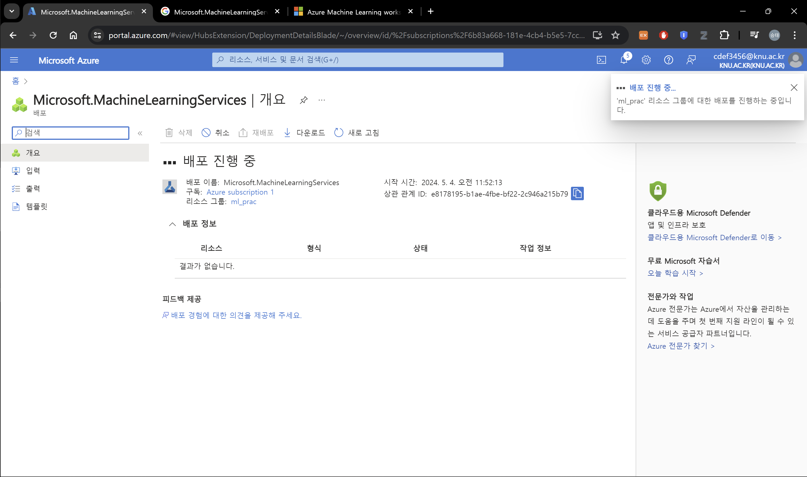

# Azure Machine Learning에서 자동화된 Machine Learning 살펴보기

이 연습에서는 Azure Machine Learning의 자동화된 기계 학습 기능을 사용하여 기계 학습 모델을 학습하고 평가합니다. 그런 다음 훈련된 모델을 배포하고 테스트합니다.

## Azure Machine Learning 작업 영역 만들기

Azure Machine Learning을 사용하려면 당신의 Azure 구독에서 Azure Machine Learning 작업 영역을 마련해야 합니다. 그런 다음 Azure Machine Learning Studio를 사용하여 작업 영역의 리소스로 작업할 수 있습니다.

```
이미 Azure Machine Learning workspace를 가지고 있으면 다음 단계로 넘어가세요
```
 1. [Azure portal(https://portal.azure.com/)](https://portal.azure.com/)에 microsoft 계정으로 로그인<br>
 2. \+ 리소스 만들기 클릭<br>
 3. **Machine Learning** 검색하여 새로운 **Azure Machine Learning** 리소스 만들기<br>
 4. <br>
 5. **검토 + 만들기** 선택 > **만들기** 선택<br>
 6. 기다리기...
 7. **Launch studio** 선택 (또는 https://ml.azure.com 으로 이동하여 Microsoft 계정으로 로그인)
 8. 만약 방금 만든 워크스페이스가 아니면 왼쪽의 **All workspace** 선택하여 새로 만든 workspace로 이동


TODO : 생성에 계속 실패함. 원인 파악 필요


# 출처
[Explore Automated Machine Learning in Azure Machine Learning](https://microsoftlearning.github.io/mslearn-ai-fundamentals/Instructions/Labs/01-machine-learning.html)