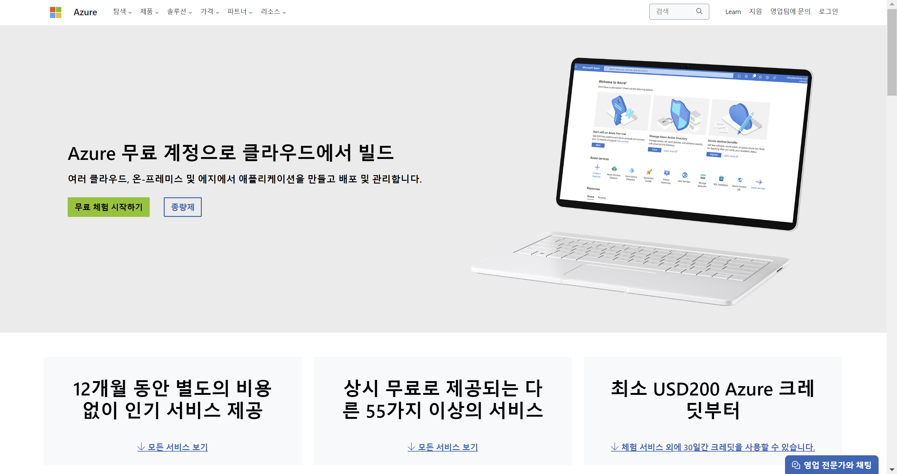
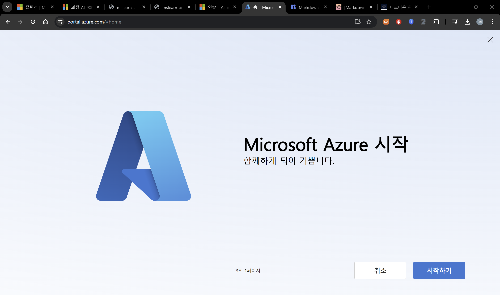
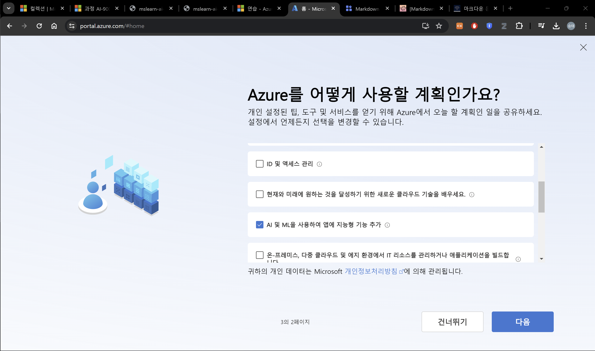
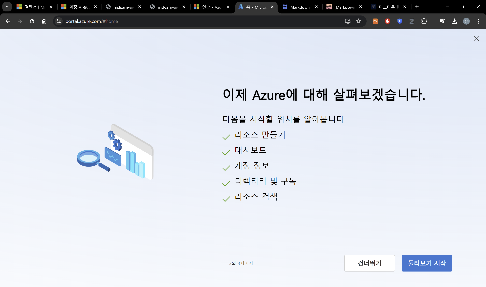
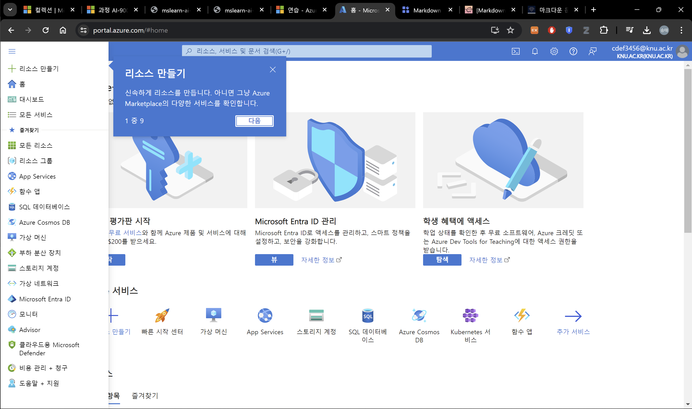
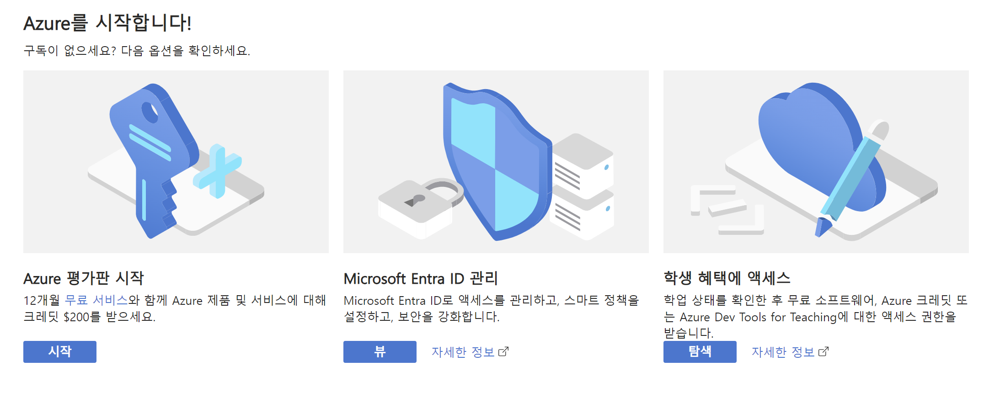
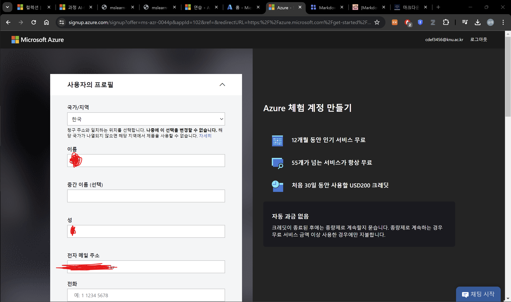
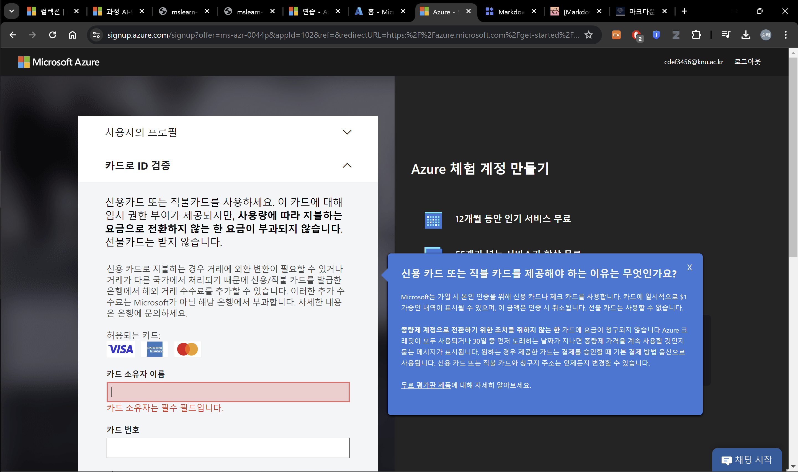
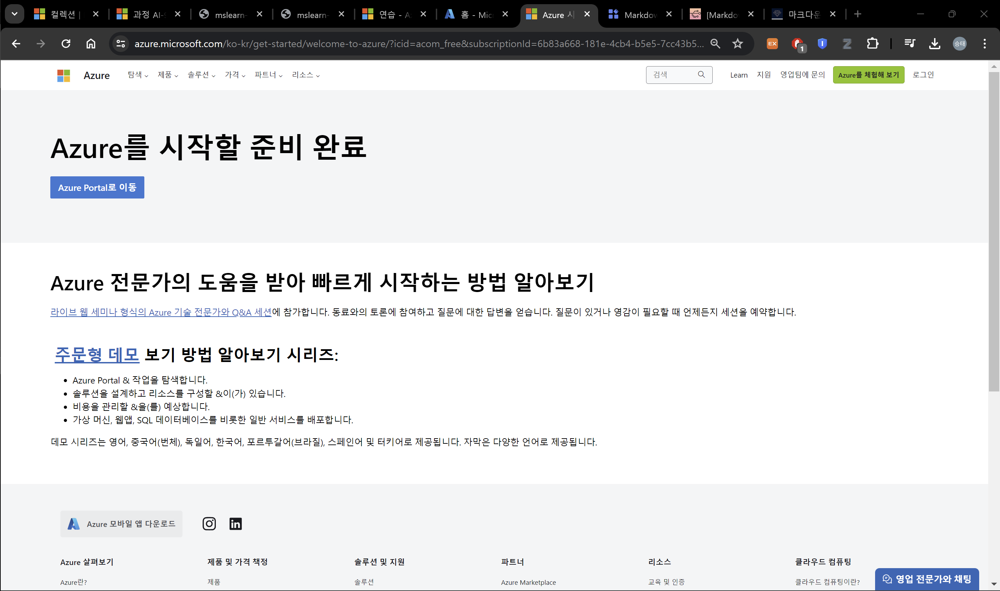

# Azure 무료 체험 시작하는 법

 1. [https://azure.microsoft.com/ko-kr/free/](https://azure.microsoft.com/ko-kr/free/)에 접속 

 2. Microsoft 계정으로 로그인
    1.   시작하기 선택
    2.   다음 선택
    3.   둘러보기 시작 선택
    4.   둘러보기
 
 3.   Azure 평가판 시작
 4.   무료 체험 시작하기
 5.   정보 입력 후 다음
 6.   카드 정보 입력 후 등록
 7.   완료
