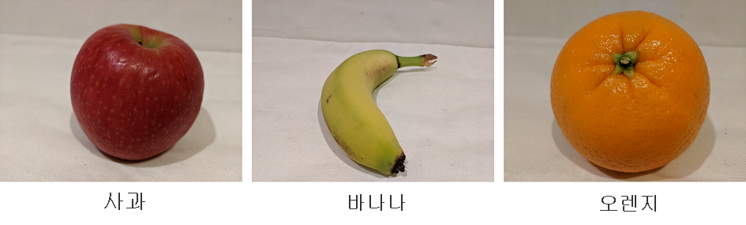
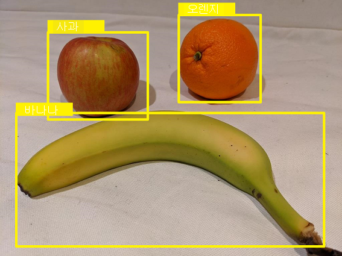

# 사용자 지정 Azure AI Vision 모델을 사용하여 이미지 분류

## 목차
- [사용자 지정 Azure AI Vision 모델을 사용하여 이미지 분류](#사용자-지정-azure-ai-vision-모델을-사용하여-이미지-분류)
  - [목차](#목차)
  - [소개](#소개)
  - [사용자 지정 모델 형식 이해](#사용자-지정-모델-형식-이해)
    - [이미지 분류](#이미지-분류)
    - [개체 감지](#개체-감지)
    - [제품 인식](#제품-인식)
  - [사용자 지정 프로젝트 만들기](#사용자-지정-프로젝트-만들기)
    - [Custom Vision 프로젝트의 구성 요소](#custom-vision-프로젝트의-구성-요소)
    - [COCO 파일](#coco-파일)
    - [데이터 세트 만들기](#데이터-세트-만들기)
  - [사용자 지정 모델 레이블 지정 및 학습](#사용자-지정-모델-레이블-지정-및-학습)
    - [학습 이미지에 레이블 지정](#학습-이미지에-레이블-지정)
    - [모델 학습](#모델-학습)
  - [연습 - Azure AI Vision 사용자 지정 모델을 사용하여 이미지 분류](#연습---azure-ai-vision-사용자-지정-모델을-사용하여-이미지-분류)
  - [요약](#요약)
  - [출처](#출처)

---
## 소개

Azure AI Vision의 사용자 지정 모델을 사용하면 이미지를 분류하거나 이미지에서 개체를 검색하도록 AI 모델을 학습시킬 수 있습니다.

이미지 분류는 범주화(또는 분류)하기 위해 소프트웨어에 이미지를 분석하도록 요구하는 일반적인 Computer Vision 문제입니다. 이 모듈에서는 Azure AI Vision 서비스를 사용하여 이미지 분류를 위한 사용자 지정 비전 모델을 빌드하는 방법을 알아봅니다.

개체 감지 는 소프트웨어가 이미지에서 특정 개체 클래스의 위치를 식별해야 하는 또 다른 일반적인 컴퓨터 비전 문제입니다. 개체 검색 프로젝트를 만드는 것은 만들기부터 레이블 지정 및 학습까지 이미지 분류 프로젝트와 동일한 패턴을 따릅니다. 이 모듈에서는 개체 감지에 대한 개념과 고려 사항을 다루며, 연습에서는 분류에 중점을 둡니다.

---
## 사용자 지정 모델 형식 이해

사용자 지정 Azure AI Vision 모델에는 유형에 따라 다른 기능이 있습니다. 사용자 지정 모델 유형에는 이미지 분류, 개체 검색 및 제품 인식이 포함됩니다.

### 이미지 분류

이미지 분류는 전체 이미지의 내용을 기반으로 이미지의 레이블을 예측하도록 모델을 학습하는 컴퓨터 비전 기능입니다. 일반적으로 클래스 레이블은 이미지의 기본 주체와 관련이 있지만 개별 사용 사례는 다를 수 있습니다.

예를 들어 다음 이미지는 포함된 과일의 유형에 따라 분류됩니다.



다중 클래스 분류(여러 클래스가 있지만 각 이미지는 하나의 클래스에만 속할 수 있는 경우) 또는 다중 레이블 분류(이미지가 여러 레이블과 연결될 수 있는 경우)에 대해 모델을 학습할 수 있습니다.

### 개체 감지

개체 감지는 이미지에서 하나 이상의 개체 클래스의 존재 및 위치를 감지하도록 모델을 학습시키는 Computer Vision의 한 형태입니다. 예를 들어 식료품점의 검사 시스템 검사 AI를 사용하는 경우 구매 중인 항목의 유형과 위치를 식별해야 할 수 있습니다.



개체 검색에는 다음 두 가지 구성 요소가 있습니다.

 - 이미지에서 감지된 각 개체의 클래스 레이블. 예를 들어 이미지에 사과 1개와 오렌지 2개가 포함되어 있다고 예측할 수 있습니다.
 - 개체를 둘러싸는 경계 상자의 좌표로 표시되는 이미지 내의 각 개체 위치.

### 제품 인식

제품 인식은 개체 감지와 동일한 방식으로 작동하지만 제품 레이블 및 브랜드 이름에 대한 정확도가 향상되었습니다. 제품 인식에 대한 예측에는 클래스 레이블과 위치가 모두 있으므로 이미지에서 제품이 어디에 있는지 알 수 있습니다.

---
## 사용자 지정 프로젝트 만들기

사용자 지정 Azure AI Vision 모델을 만들려면 먼저 Azure AI Services 리소스(또는 Azure AI Vision 리소스)가 필요합니다. 해당 리소스가 구독에 배포되면 사용자 지정 프로젝트를 만들어야 합니다.

### Custom Vision 프로젝트의 구성 요소

사용자 지정 프로젝트의 첫 번째 구성 요소는 데이터 세트입니다. 데이터 세트는 모델을 학습하는 동안 사용할 이미지 컬렉션과 해당 이미지에 대한 레이블 정보를 정의하는 COCO 파일 입니다. 데이터 세트는 Azure Blob Storage 컨테이너에 저장되며, 이 단원에서는 COCO 파일에 대해 자세히 설명합니다.

이미지 및 클래스 레이블이 정의되면 사용자 지정 모델을 학습시킬 수 있습니다. 모델을 학습할 때 학습할 모델 유형, 사용할 데이터 세트 및 학습 예산(시간)을 지정합니다. 모델 학습이 완료되면 성능을 보고 예측을 위해 모델을 사용할 수 있습니다.

대부분의 경우 수행하는 단계는 다음과 같습니다.

 1. Blob Storage 컨테이너를 만들고 학습 이미지만 업로드합니다.
 2. 프로젝트에 대한 데이터 세트를 만들고 Blob Storage 컨테이너에 연결합니다. 데이터 세트를 만들 때 프로젝트 유형(이미지 분류, 개체 검색 또는 제품 인식)을 정의합니다.
 3. Blob Storage 컨테이너에 COCO 파일을 만드는 Azure Machine Learning 데이터 레이블 지정 프로젝트의 데이터에 레이블을 지정합니다.
 4. 레이블이 지정된 이미지의 완성된 COCO 파일을 데이터 세트에 커넥트.
 5. 만든 데이터 세트 및 레이블에 대한 사용자 지정 모델을 학습시킵니다.
 6. 성능을 확인하고 학습된 성능이 기대에 맞지 않는지 반복합니다.

성능에 만족하면 Vision Studio 또는 사용자 고유의 애플리케이션에서 모델을 사용할 수 있습니다.

### COCO 파일


COCO 파일은 다음을 정의하는 특정 형식의 JSON 파일입니다.

 - 이미지: Blob Storage, 이름, 너비, 높이 및 ID에서 이미지 위치를 정의합니다.
 - 주석: 이미지가 분류되는 범주, 영역 및 경계 상자를 포함하여 분류(또는 개체)를 정의합니다(개체 검색을 위해 레이블을 지정하는 경우).
 - categories: 명명된 레이블 클래스의 ID를 정의합니다.

대부분의 경우 COCO 파일은 Azure Machine Learning 데이터 레이블 지정 프로젝트에서 학습 이미지에 레이블을 지정하여 생성됩니다. 이전 Custom Vision 프로젝트에서 마이그레이션하는 경우 마이그레이션 스크립트를 사용하여 COCO 파일을 만들 수 있습니다.

샘플 COCO 파일은 다음과 같습니다.

```json
{
  "images": [
    {
      "id": 1,
      "width": 1024,
      "height": 768,
      "file_name": "abc.jpg",
      "coco_url": "AmlDatastore://fruit/abc.jpg",
      "absolute_url": "https://myBlobStorage.blob.core.windows.net/fruit/abc.jpg",
      "date_captured": "<date>"
    },
    {
      "id": 2,
      "width": 1024,
      "height": 768,
      "file_name": "xyz.jpg",
      "coco_url": "AmlDatastore://fruit/xyz.jpg",
      "absolute_url": "https://myBlobStorage.blob.core.windows.net/fruit/xyz.jpg",
      "date_captured": "<date>"
    },
    <...>
  ],
  "annotations": [
    {
      "id": 1,
      "category_id": 1,
      "image_id": 1,
      "area": 0.0
    },
    {
      "id": 2,
      "category_id": 1,
      "image_id": 2,
      "area": 0.0
    },
    <...>
  ],
  "categories": [
    {
      "id": 1,
      "name": "apple"
    },
    {
      "id": 2,
      "name": "orange"
    },
    {
      "id": 3,
      "name": "banana"
    }
  ]
}
```

개체 검색 데이터 세트에 레이블을 지정하는 경우 COCO 파일의 각 주석에는 배열의 값이 Left, Top, Width 및 Height인 경계 상자 배열도 포함됩니다.

```json
"bbox": [
    0.11803319477782331,
    0.41586723392402375,
    0.7765206955096307,
    0.3483334397217212
]
```

### 데이터 세트 만들기

Blob Storage 컨테이너에 이미지가 있으면 REST API를 사용하거나 Vision Studio를 사용하여 학습할 데이터 세트를 만들 수 있습니다. REST 요청은 다음 REST 호출과 유사합니다.

```
curl -X PUT https://<endpoint>/computervision/datasets/<dataset-name>?api-version=<version>\
  -H "Content-Type: application/json" \
  -H "Ocp-Apim-Subscription-Key: <subscription-key>" \
  --data-ascii "
  {
    'annotationKind':'imageClassification',
    'annotationFileUris':['<URI>']
  }"
```

Vision Studio를 사용하는 경우 사용자 지정 모델 타일로 이동하여 리소스를 선택하고 데이터 세트를 만듭니다. 여기에서 Azure Machine Learning 데이터 레이블 지정 프로젝트를 열거나 만들거나 기존 COCO 파일을 업로드할 수 있습니다. 이 모듈의 연습에서는 이러한 방식으로 데이터 세트를 만드는 방법을 안내합니다.

Vision Studio를 사용하면 REST 요청에서 COCO 파일을 지정하는 대신 Azure Machine Learning에서 레이블 지정 프로젝트에 연결할 수 있습니다. 이 모듈의 나머지 예제에서는 Vision Studio를 사용하지만 REST가 선호하는 방법인 경우 설명서 페이지에서 사용할 수 있습니다.

---
## 사용자 지정 모델 레이블 지정 및 학습

Blob Storage에 이미지를 업로드하고 데이터 세트를 만든 후 다음 단계는 이미지에 레이블을 지정하고 결과 COCO 파일을 연결하는 것입니다. 학습 이미지에 대한 COCO 파일이 이미 있는 경우 레이블 지정 단계를 건너뛸 수 있습니다.

### 학습 이미지에 레이블 지정

학습 이미지에 레이블을 지정하는 작업은 데이터 레이블 지정 프로젝트를 사용하여 Azure Machine Learning 스튜디오에서 수행됩니다. 학습 이미지에 대한 완전하고 정확한 레이블을 가지면 학습된 모델의 성능이 크게 개선됩니다. 이미지에 레이블을 할당할 때 레이블을 정확하게 할당하고 각 클래스의 모든 인스턴스에 완전히 레이블을 할당해야 합니다.

Vision Studio 내의 데이터 세트에서 새 Azure Machine Learning 데이터 레이블 지정 프로젝트를 만들거나, Azure Machine Learning 스튜디오에서 프로젝트를 만든 경우 기존 프로젝트에 연결합니다.


프로젝트가 만들어지면 해당 단추를 선택하면 Azure Machine Learning 스튜디오로 이동하여 레이블 지정 프로젝트가 열립니다. Azure Machine Learning 데이터 레이블 지정에서는 이미지 또는 개체(예: 사과, 오렌지, 바나나)에 대한 범주를 추가할 수 있습니다. 범주가 있으면 프로젝트를 시작하고 레이블 지정 탭으로 이동합니다. 범주당 3~5개의 이미지에 레이블을 지정해야 합니다.


이미지의 하위 집합에 대해 제공한 일부 레이블을 가져와 나머지 이미지에 레이블을 지정하는 ML 지원 레이블 지정과 같이 레이블 지정에 도움이 되는 Azure Machine Learning 도구가 있습니다. 이러한 기능을 사용하는 경우 레이블이 정확한지 검토해야 합니다. 정확하지 않으면 학습된 모델의 성능이 저하됩니다.

레이블 지정이 완료되고 모든 학습 이미지가 올바르게 분류되거나 레이블이 지정되면 Azure Machine Learning 작업 영역에서 직접 데이터 세트에 COCO 파일을 추가할 수 있습니다.

### 모델 학습

모든 학습 이미지에 레이블이 지정되면 다음 단계는 모델을 학습하는 것입니다. 모델을 학습할 때 모델 형식을 선택하고, 학습 데이터로 사용할 데이터 세트를 지정하고, 학습 예산을 표시합니다. 학습 예산은 학습이 실행되는 기간에 대한 상한입니다. 학습에 사용되는 실제 시간은 지정된 예산보다 적은 경우가 많습니다.

모델이 학습되면 모델을 선택하여 평가 실행 성능을 볼 수 있습니다. 모델 학습 시 평가 데이터 세트가 제공되지 않으면 기본 평가 실행이 사용됩니다. 기본 평가 실행은 학습 집합에서 레이블이 지정된 이미지의 작은 집합을 가져와 해당 하위 집합에 대한 예측을 위해 학습된 모델을 사용하고 예측을 제공된 레이블과 비교합니다.

학습된 모델 페이지에서 페이지 상단의 탭을 선택하여 다양한 이미지 집합에 대해 새로운 평가 실행을 트리거하거나 Vision Studio에서 자체 테스트를 테스트해 볼 수 있습니다.

---
## 연습 - Azure AI Vision 사용자 지정 모델을 사용하여 이미지 분류

TODO : 실습자료 만들기

---
## 요약

Azure AI Vision의 사용자 지정 모델을 사용하면 사용자가 제공하고 레이블을 지정하는 이미지에서 이미지를 분류하거나 개체를 검색하는 AI 모델을 만들고 학습할 수 있습니다. 이러한 사용자 지정 모델을 사용하면 사용 사례에 필요한 항목을 정확하게 분류하거나 검색할 수 있습니다.

이 모듈에서 학습한 내용은 다음과 같습니다.
 - Azure AI Vision을 사용하여 사용자 지정 모델 만들기
 - 이미지 분류 이해
 - 개체 감지 이해
 - Vision Studio에서 이미지 분류자 레이블 지정 및 학습

추가로 읽을 만한 내용:
 - 사용자 지정 이미지 분석 모델 만들기
 - Azure AI Vision 설명서

---
## 출처
[Microsoft learn 사용자 지정 Azure AI Vision 모델을 사용하여 이미지 분류](https://learn.microsoft.com/ko-kr/training/modules/custom-model-ai-vision-image-classification/)