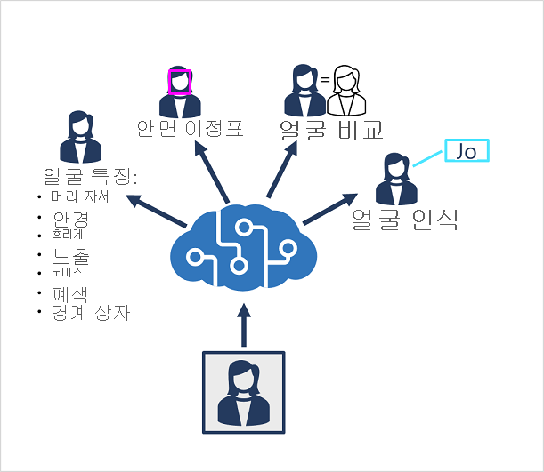
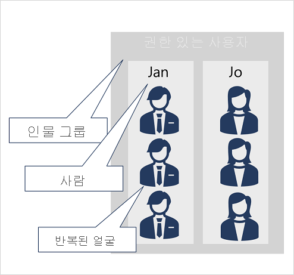

# 얼굴 감지, 분석 및 인식

## 목차
- [얼굴 감지, 분석 및 인식](#얼굴-감지-분석-및-인식)
  - [목차](#목차)
  - [소개](#소개)
  - [얼굴 감지, 분석 및 식별 옵션 파악](#얼굴-감지-분석-및-식별-옵션-파악)
    - [Azure AI Vision 서비스](#azure-ai-vision-서비스)
    - [Face 서비스](#face-서비스)
  - [얼굴 분석에 대한 고려 사항 이해](#얼굴-분석에-대한-고려-사항-이해)
  - [Azure AI 비전 서비스로 얼굴 감지](#azure-ai-비전-서비스로-얼굴-감지)
  - [Face 서비스의 기능 이해](#face-서비스의-기능-이해)
  - [감지된 얼굴 비교 및 일치](#감지된-얼굴-비교-및-일치)
  - [얼굴 인식 구현](#얼굴-인식-구현)
  - [연습 - 얼굴 감지, 분석 및 식별](#연습---얼굴-감지-분석-및-식별)
  - [요약](#요약)
  - [출처](#출처)

---
## 소개

얼굴 감지, 분석 및 인식은 AI 시스템의 일반적인 Computer Vision 과제입니다. 안면을 토대로 사람이 있을 때 감지하거나, 사람의 얼굴 위치를 식별하거나, 개인을 인식하는 기능은 AI 시스템에서 사람과 같은 동작을 나타내고 사용자와의 공감대를 구축할 수 있는 주요 방법입니다.

이 모듈에서는 Azure AI 서비스를 사용하여 얼굴을 감지, 분석 및 인식하는 방법을 알아봅니다.

이 모듈을 완료한 후에는 다음을 수행할 수 있습니다.

 - 얼굴 감지 분석을 위한 옵션을 식별합니다.
 - 얼굴 분석에 대한 고려 사항을 설명합니다.
 - Azure AI 비전 서비스를 사용하여 얼굴을 감지합니다.
 - Face 서비스의 기능을 설명합니다.
 - 얼굴 인식에 대해 알아봅니다.

---
## 얼굴 감지, 분석 및 식별 옵션 파악

이미지에서 얼굴 또는 사람을 감지하는 솔루션을 빌드하는 데 사용할 수 있는 두 가지 Azure AI 서비스가 있습니다.


### Azure AI Vision 서비스

Azure AI Vision 서비스를 사용하면 이미지의 사용자를 감지하고 해당 위치에 대한 경계 상자를 반환할 수 있습니다.

### Face 서비스

Face 서비스는 다음을 포함하여 Azure AI 비전 서비스보다 더 포괄적인 얼굴 분석 기능을 제공합니다.

 - 얼굴 감지(경계 상자 사용)
 - 종합적인 안면 분석(머리 자세, 안경 유무, 흐릿함, 얼굴 특색, 치아 상태 등)
 - 얼굴 비교 및 확인
 - 얼굴 인식

```
얼굴 인식, 식별, 비교 및 확인을 사용하려면 제한된 액세스 정책을 통해 승인을 받아야 합니다. 책임 있는 AI 표준에 이 정책을 추가하는 방법에 대해 자세히 알아보세요. 얼굴 인식은 이 모듈의 나머지 부분에 적용되지만 제한된 액세스를 신청하지 않고는 사용할 수 없습니다.
```

---
## 얼굴 분석에 대한 고려 사항 이해

모든 인공 지능 애플리케이션에서는 책임 있는 윤리적 사용을 고려해야 하지만, 얼굴 데이터를 사용하는 시스템은 특히 문제가 될 수 있습니다.

얼굴 데이터를 사용하는 솔루션을 빌드하는 경우 고려해야 할 사항은 다음과 같습니다.

 - 데이터, 개인 정보 및 보안. 얼굴 데이터는 개인을 식별할 수 있므로 민감한 비공개 데이터로 간주해야 합니다. 모델 학습 및 추론에 사용되는 얼굴 데이터에 대해 적절한 보호를 구현했는지 확인해야 합니다.
 - 투명성. 사용자에게 자신의 얼굴 데이터가 어떻게 사용되는지, 누가 해당 데이터에 액세스할 수 있는지에 대한 정보를 제공합니다.
 - 공정성 및 포용성. 얼굴 기반 시스템은 외모에 따라 개인에게 불리하거나 개인을 불공정하게 타기팅하는 방식으로 사용하면 안 됩니다.

---
## Azure AI 비전 서비스로 얼굴 감지

Azure AI Vision 서비스를 사용하여 얼굴을 감지하고 분석하려면 이미지 분석 함수(SDK 또는 동등한 REST 메서드)를 호출하여 반환할 시각적 기능 중 하나로 사람 지정합니다.

하나 이상의 사용자가 포함된 이미지에서 응답에는 이미지에서 해당 위치의 세부 정보와 검색된 사람의 특성이 다음과 같이 포함됩니다.

```json
{ 
  "modelVersion": "2023-10-01",
  "metadata": {
    "width": 400,
    "height": 600
  },
  "peopleResult": {
    "values": [
      {
        "boundingBox": {
          "x": 0,
          "y": 56,
          "w": 101,
          "h": 189
        },
        "confidence": 0.9474349617958069
      },
      {
        "boundingBox": {
          "x": 402,
          "y": 96,
          "w": 124,
          "h": 156
        },
        "confidence": 0.9310565276194865
      },
    ...
    ]
  }
}
```
Azure AI Vision 사용자 감지에 대한 자세한 내용은 사람 검색 개념 페이지를 참조하세요.

```
Azure AI 비전에는 이전에 연령 및 성별 예측이 포함되었지만 책임 있는 사용을 위한 보호 장치로 제거되었습니다. 책임 있는 AI 투자에 대한 자세한 내용은 여기에서 확인할 수 있습니다.
```

---
## Face 서비스의 기능 이해

Face 서비스는 포괄적인 얼굴 감지, 분석 및 인식 기능을 제공합니다.



Face 서비스는 다음에 사용할 수 있는 기능을 제공합니다.

 - 얼굴 감지 - 감지된 각 얼굴에 대한 결과에는 얼굴을 식별하는 ID와 이미지에서의 얼굴 위치를 나타내는 경계 상자 좌표가 포함됩니다.
 - 얼굴 특성 분석 - 다음을 포함하여 다양한 얼굴 특성을 반환할 수 있습니다.
   - 머리 자세(3D 공간에서 피치, 롤 및 기울어짐 방향)
   - 안경(안경 없음, 돋보기, 선글라스 또는 수경)
   - 흐림(낮음, 보통 또는 높음)
   - 노출(underExposure, goodExposure 또는 overExposure)
   - 노이즈(이미지의 시각적 노이즈)
   - 폐색(얼굴을 가리는 물체)
   - 액세서리(안경, 모자, 마스크)
   - QualityForRecognition(낮음, 중간 또는 높음)
 - 얼굴 특징 부위 위치 - 안면 특징과 관련된 주요 특징 부위(예: 눈 중심, 눈동자, 코끝 등)의 좌표
 - 얼굴 비교 - 여러 이미지의 얼굴을 비교하여 유사성(안면 특징이 유사한 개인 찾기)을 알아내고 확인(한 이미지의 얼굴이 다른 이미지의 얼굴과 같은 사람인지 확인)할 수 있습니다.
 - 얼굴 인식 - 특정 개인에게 속한 얼굴 컬렉션을 모델에게 학습시키고 해당 모델을 사용하여 새 이미지에서 해당 사용자를 식별할 수 있습니다.
 - 얼굴 활동성 - 활동성은 입력 비디오가 실제 스트림인지 또는 잘못된 의도의 개인이 인식 시스템을 스푸핑하는 것을 방지하기 위해 가짜인지 확인하는 데 사용할 수 있습니다.

Face을 단일 서비스 리소스로 프로비저닝하거나 다중 서비스 Azure AI 서비스 리소스에서 Face API를 사용할 수 있습니다.

얼굴의 식별, 인식 및 확인 기능을 사용하려면 이러한 기능을 사용할 수 있기 전에 제한된 액세스 정책을 신청하고 승인을 받아야 합니다.

---
## 감지된 얼굴 비교 및 일치

Face 서비스에서 얼굴을 감지하면 고유한 ID가 할당되고 24시간 동안 서비스 리소스에 유지됩니다. 이 ID는 안면 특징 이외의 개인 식별 정보는 없는 GUID입니다.

```
얼굴 인식, 비교 및 확인을 사용하려면 제한된 액세스 정책을 통해 승인을 받아야 합니다. 책임 있는 AI 표준에 이 정책을 추가하는 방법에 대해 자세히 알아보세요. 얼굴 인식은 제한된 액세스 정책이 부여될 때까지 새 고객이 사용할 수 없습니다.
```

감지된 얼굴 ID가 캐시되는 동안 후속 이미지를 사용하여 새 얼굴을 캐시된 ID와 비교하고 유사한지 확인하거나(즉, 유사한 안면 특징 공유), 동일한 사람이 두 이미지에 나타나는지 확인할 수 있습니다.


얼굴을 익명으로 비교하는 이 기능은 사람의 실제 ID를 알 필요 없이 동일한 사람이 두 경우에 존재하는지 확인하는 것이 중요한 시스템에서 유용할 수 있습니다. 예를 들어, 보안 장소에 들어오고 나가는 사람의 이미지를 촬영하여 들어온 모든 사람이 나갔는지 확인할 수 있습니다.

---
## 얼굴 인식 구현

개인을 적극적으로 식별해야 하는 시나리오의 경우 얼굴 이미지를 얼굴 인식 모델에 학습시킬 수 있습니다.

```
이전 단원에서 설명한 대로 인식 모델은 제한된 액세스 정책을 통해 승인을 받아야 합니다.
```

Face 서비스를 사용하여 얼굴 인식 모델을 학습시키려면 다음을 수행합니다.

 1. 식별하려는 개인 집합(예: ‘직원’)을 정의하는 개인 그룹을 만듭니다.
 2. 식별하려는 각 개인에 대한 개인 그룹에 개인을 추가합니다.
 3. 여러 이미지에서 감지된 얼굴을 각 개인에 추가합니다. 이때 가급적 다양한 자세의 이미지를 추가합니다. 이러한 얼굴의 ID는 더 이상 24시간 후에 만료되지 않습니다. 따라서 이제 보관된 얼굴이라고 합니다.
 4. 모델을 학습시킵니다.



학습된 모델은 Face(또는 Azure AI 서비스) 리소스에 저장되며 클라이언트 애플리케이션에서 다음을 수행하는 데 사용할 수 있습니다.

 - 이미지에서 개인을 식별합니다.
 - 감지된 얼굴의 ID를 확인합니다.
 - 새 이미지를 분석하여 알려진 보관된 얼굴과 유사한 얼굴을 찾습니다.

---
## 연습 - 얼굴 감지, 분석 및 식별

TODO : 실습자료 만들기

---
## 요약

이 모듈에서는 얼굴을 감지, 분석 및 인식하는 방법을 배웠습니다.

이제 이 모듈을 완료했으므로 다음을 수행할 수 있습니다.

 - 얼굴 감지 분석을 위한 옵션을 식별합니다.
 - 얼굴 분석에 대한 고려 사항을 설명합니다.
 - Azure AI Vision 서비스를 사용하여 사용자를 검색합니다.
 - Face 서비스의 기능을 설명합니다.
 - 얼굴 인식을 이해합니다.

Azure AI 비전 서비스를 사용한 얼굴 인식에 대해 자세히 알아보려면 Azure AI 비전 문서를 참조하세요. Face 서비스에 대해 자세히 알아보려면 Face 설명서를 참조하세요.

---
## 출처
[Microsoft learn 얼굴 감지, 분석 및 인식](https://learn.microsoft.com/ko-kr/training/modules/detect-analyze-recognize-faces/)