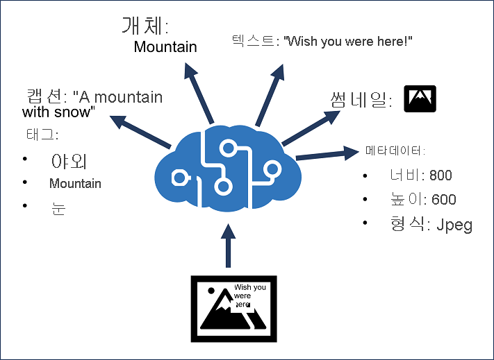

# 이미지 분석

## 목차
- [이미지 분석](#이미지-분석)
  - [목차](#목차)
  - [소개](#소개)
  - [Azure AI 비전 리소스 프로비전](#azure-ai-비전-리소스-프로비전)
  - [이미지 분석](#이미지-분석-1)
  - [스마트하게 자른 썸네일 생성 및 배경 제거](#스마트하게-자른-썸네일-생성-및-배경-제거)
    - [이미지 배경 제거](#이미지-배경-제거)
  - [연습 - Azure AI 비전을 사용하여 이미지 분석](#연습---azure-ai-비전을-사용하여-이미지-분석)
  - [요약](#요약)
  - [출처](#출처)

---
## 소개

Azure AI 비전은 소프트웨어가 이미지 또는 비디오 피드에서 시각적 입력을 해석하는 AI(인공 지능)의 분야입니다.

이 모듈에서는 Azure AI 비전 서비스를 사용하여 이미지에서 정보를 추출하는 방법을 알아봅니다.

이 모듈을 완료한 후에는 다음을 수행할 수 있습니다.

 - Azure AI 비전 리소스 프로비전.
 - 이미지를 분석합니다.
 - 스마트하게 잘린 썸네일을 생성합니다.

---
## Azure AI 비전 리소스 프로비전

Azure AI 비전 서비스는 이미지에서 정보를 추출하는 데 도움이 되도록 설계되었습니다. 이 서비스는 다음에 사용할 수 있는 기능을 제공합니다.

 - 설명 및 태그 생성 - 이미지에 대한 적절한 캡션을 결정하고 해당 제목을 나타내는 키워드로 사용할 수 있는 관련 "태그"를 식별합니다.
 - 개체 감지 - 이미지 내에서 특정 개체의 존재 및 위치를 감지합니다.
 - 인물 감지 - 이미지에서 사람들의 존재, 위치 및 특징을 감지합니다.
 - 이미지 메타데이터, 색 및 형식 분석 - 이미지의 형식 및 크기, 주요 색상표 및 클립 아트를 포함하는지 여부를 결정합니다.
 - 범주 식별 - 이미지에 대한 적절한 분류를 식별하고 알려진 랜드마크가 포함되어 있는지 여부를 확인합니다.
 - 배경 제거 - 이미지에서 배경을 감지하고 배경이 투명한 이미지나 회색조 알파 무광택 이미지를 출력합니다.
 - 조정 등급 - 이미지에 성인물 또는 폭력적 콘텐츠가 포함되어 있는지 확인합니다.
광학 문자 인식 - 이미지에서 텍스트를 읽습니다.
 - 스마트 썸네일 생성 - 이미지에서 관심 있는 기본 영역을 식별하여 더 작은 "썸네일" 버전을 만듭니다.



Azure AI 비전을 단일 서비스 리소스로 프로비전하거나 다중 서비스 Azure AI 서비스 리소스에서 Azure AI 비전 API를 사용할 수 있습니다.

---
## 이미지 분석

이미지를 분석하려면 선호하는 프로그래밍 언어용 SDK에서 이미지 분석 REST 메서드 또는 동급의 메서드를 사용하여 분석에 포함할 시각적 기능을 지정합니다(또한 범주를 선택하는 경우 유명인 또는 랜드마크의 세부 정보를 포함할지 여부 지정). 이 메서드는 요청된 정보를 포함하는 JSON 문서를 반환합니다.

```
유명인을 검색하려면 제한된 액세스 정책을 통해 승인을 받아야 합니다. 책임 있는 AI 표준에 이 정책을 추가하는 방법에 대해 자세히 알아보세요. 일부 스크린샷에는 유명인 인식이 표시되지만 랩에는 포함되지 않습니다.
```

[source code](../src/image_processing.py)
```python
from azure.ai.vision.imageanalysis import ImageAnalysisClient
from azure.ai.vision.imageanalysis.models import VisualFeatures
from azure.core.credentials import AzureKeyCredential

client = ImageAnalysisClient(
    endpoint=os.environ["ENDPOINT"],
    credential=AzureKeyCredential(os.environ["KEY"])
)

result = client.analyze(
    image_url="<url>",
    visual_features=[VisualFeatures.CAPTION, VisualFeatures.READ],
    gender_neutral_caption=True,
    language="en",
)
```

사용 가능한 시각적 기능은 열거형에 VisualFeatures 포함됩니다.

 - VisualFeatures.TAGS: 개체, 풍경, 설정 및 작업을 포함하여 이미지에 대한 태그를 식별합니다.
 - VisualFeatures.OBJECTS: 검색된 각 개체에 대한 경계 상자를 반환합니다.
 - VisualFeatures.CAPTION: 자연어로 이미지의 캡션 생성합니다.
 - VisualFeatures.DENSE_CAPTIONS: 검색된 개체에 대한 자세한 캡션 생성합니다.
 - VisualFeatures.PEOPLE: 검색된 사용자에 대한 경계 상자를 반환합니다.
 - VisualFeatures.SMART_CROPS: 관심 영역에 대해 지정된 가로 세로 비율의 경계 상자를 반환합니다.
 - VisualFeatures.READ: 읽을 수 있는 텍스트를 추출합니다.

이미지에서 분석하려는 시각적 기능을 지정하면 응답에 포함할 정보가 결정됩니다. 대부분의 응답에는 경계 상자(이미지의 위치가 적절한 경우) 또는 신뢰도 점수(태그 또는 캡션 같은 기능의 경우)가 포함됩니다.

이미지 분석에 대한 JSON 응답은 요청된 기능에 따라 이 예제와 유사합니다.

```
{
  "apim-request-id": "abcde-1234-5678-9012-f1g2h3i4j5k6",
  "modelVersion": "<version>",
  "denseCaptionsResult": {
    "values": [
      {
        "text": "a house in the woods",
        "confidence": 0.7055229544639587,
        "boundingBox": {
          "x": 0,
          "y": 0,
          "w": 640,
          "h": 640
        }
      },
      {
        "text": "a trailer with a door and windows",
        "confidence": 0.6675070524215698,
        "boundingBox": {
          "x": 214,
          "y": 434,
          "w": 154,
          "h": 108
        }
      }
    ]
  },
  "metadata": {
    "width": 640,
    "height": 640
  }
}
```

---
## 스마트하게 자른 썸네일 생성 및 배경 제거

썸네일은 종종 애플리케이션 및 웹 사이트에서 더 작은 버전의 이미지를 제공하는 데 사용됩니다. 예를 들어, 관광지는 각 유적지에 대한 대표적인 작은 썸네일 이미지로 도시에 있는 작은 관광용 유적지 목록을 표시하고, 사용자가 개별 유적지에 대한 "세부 정보" 페이지를 선택할 때만 전체 이미지를 표시할 수 있습니다.

Azure AI 비전 서비스를 사용하면 원본 이미지와 다른 차원(및 가로 세로 비율)으로 썸네일을 만들고, 필요에 따라 이미지 분석을 사용하여 이미지의 관심 영역(해당 제목)을 확인하고 해당 영역을 썸네일의 포커스로 만들 수 있습니다. 관심 영역을 결정하는 이 기능은 이미지를 잘라 가로 세로 비율을 변경할 때 특히 유용합니다.


자른 이미지의 가로 세로 비율(너비/높이)0.751.80을 지정할 수 있습니다.

### 이미지 배경 제거

배경 제거 기능은 이미지를 포그라운드의 제목과 배경으로 간주되는 다른 모든 항목으로 분할할 수 있습니다. Azure AI Vision은 포그라운드 주체의 알파 매트를 만들어 이 기능을 달성합니다. 이 매트는 포그라운드 또는 배경을 반환하는 데 사용됩니다.

예를 들어 스케이트보더의 이 이미지 원본을 사용합니다.


배경이 제거되면 투명한 배경에서 스케이트 보더만 가져옵니다.


이미지의 알파 매트를 만들 때 결과는 검은색 배경이 있는 모든 흰색의 전경입니다.


알파 무광택 이미지는 클라이언트 애플리케이션이 포그라운드 및 배경 개체를 분리해야 하는 이미지의 추가 처리를 수행하려는 경우에 유용합니다.

---
## 연습 - Azure AI 비전을 사용하여 이미지 분석

TODO : 실습 자료 만들기

---
## 요약

이 모듈에서는 Azure AI 비전 서비스를 사용하여 이미지에서 정보를 추출하는 방법을 알아보았습니다.

이제 이 모듈을 완료했으므로 다음을 수행할 수 있습니다.

 - Azure AI 비전 리소스 프로비전.
 - 이미지를 분석합니다.
 - 스마트하게 잘린 썸네일을 생성합니다.

Azure AI 비전 서비스에 대해 자세히 알아보려면 Azure AI 비전 설명서를 참조하세요.

---
## 출처
[Microsoft learn 이미지 분석](https://learn.microsoft.com/ko-kr/training/paths/create-computer-vision-solutions-azure-ai/)