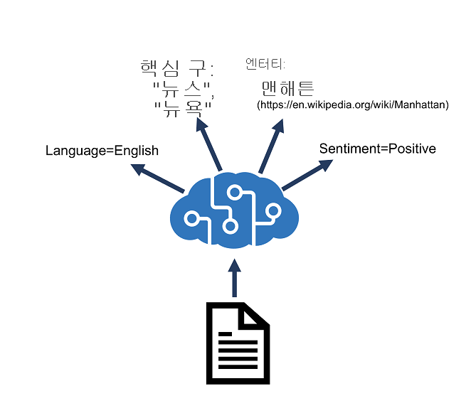

# Azure AI 언어로 텍스트 분석

## 목차
- [Azure AI 언어로 텍스트 분석](#azure-ai-언어로-텍스트-분석)
  - [목차](#목차)
  - [소개](#소개)
  - [Azure AI 언어 리소스 프로비전](#azure-ai-언어-리소스-프로비전)
    - [텍스트 분석용 Azure 리소스](#텍스트-분석용-azure-리소스)
  - [언어 검색](#언어-검색)
  - [핵심 구 추출](#핵심-구-추출)
  - [감정 분석](#감정-분석)
  - [엔터티 추출](#엔터티-추출)
  - [연결된 엔터티 추출](#연결된-엔터티-추출)
  - [연습 - 텍스트 분석](#연습---텍스트-분석)
  - [요약](#요약)
  - [출처](#출처)

---
## 소개

전 세계는 매일 방대한 양의 데이터를 생성합니다. 대부분의 데이터는 이메일, 소셜 미디어 게시물, 온라인 리뷰, 비즈니스 문서 등의 형태로 텍스트를 기반으로 합니다. 통계 및 의미 체계 모델을 적용하는 인공 지능 기술을 사용하면 이 텍스트 기반 데이터에서 의미와 인사이트를 추출하는 애플리케이션을 만들 수 있습니다.

Azure AI 언어는 사용자 고유의 애플리케이션 코드에 쉽게 통합할 수 있는 일반적인 텍스트 분석 기술에 대한 API를 제공합니다.

이 모듈에서는 Azure AI 언어를 사용하여 다음을 수행하는 방법을 알아봅니다.

 - 텍스트에서 언어 검색.
 - 텍스트 감정을 분석합니다.
 - 핵심 구, 엔터티 및 연결된 엔터티를 추출합니다.

---
## Azure AI 언어 리소스 프로비전

Azure AI 언어는 텍스트에서 정보를 추출하는 데 도움이 되도록 설계되었습니다. 이 서비스는 다음에 사용할 수 있는 기능을 제공합니다.

 - 언어 감지 - 텍스트가 작성되는 언어를 결정합니다.
 - 핵심 구 추출 - 핵심을 나타내는 텍스트의 중요한 단어와 구를 식별합니다.
 - 감정 분석 - 텍스트가 얼마나 긍정적이거나 부정적인지 정량화합니다.
 - 명명된 엔터티 인식 - 사람, 위치, 기간, 조직 등을 포함하여 엔터티에 대한 참조를 검색합니다.
 - 엔터티 연결 - Wikipedia 문서에 대한 참조 링크를 제공하여 특정 엔터티를 식별합니다.



### 텍스트 분석용 Azure 리소스

Azure AI 언어를 사용하여 텍스트를 분석하려면 Azure 구독에서 이에 대한 리소스를 프로비전해야 합니다.

Azure 구독에서 적절한 리소스를 프로비전한 후에는 해당 엔드포인트와 해당 구독 키 중 하나를 사용하여 코드에서 Azure AI 언어 API를 호출할 수 있습니다. JSON 형식의 요청을 REST 인터페이스에 제출하거나 사용 가능한 프로그래밍 언어별 SDK를 사용하여 Azure AI 언어 API를 호출할 수 있습니다.

---
## 언어 검색

Azure AI 언어 감지 API는 텍스트 입력을 평가하고 제출된 각 문서에 대해 분석의 강도를 나타내는 점수와 함께 언어 식별자를 반환합니다.

이 기능은 알 수 없는 언어로 된 임의의 텍스트를 수집하는 콘텐츠 저장소에 유용합니다. 다른 시나리오에는 채팅 봇이 포함될 수 있습니다. 사용자가 채팅 봇으로 세션을 시작하면 언어 감지를 사용하여 사용 중인 언어를 확인하고 적절한 언어로 봇 응답을 구성할 수 있습니다.

이 분석의 결과를 구문 분석하여 입력 문서에서 사용된 언어를 판별할 수 있습니다. 또한 응답에서는 모델의 신뢰도가 반영된 점수(0과 1 사이의 값)를 반환합니다.

언어 감지는 문서 또는 단일 구문에서 작동할 수 있습니다. 문서 크기는 5120자 미만이어야 한다는 점에 유의하세요. 크기 제한은 문서당 지정되며 각 컬렉션은 1,000개의 항목(ID)으로 제한됩니다. 요청 본문의 서비스에 제출할 수 있는 올바른 형식의 JSON 페이로드 샘플은 각각 고유한 ID와 분석할 텍스트를 포함하는 문서컬렉션을 포함하여 여기에 표시됩니다. 필요에 따라 countryHint를 제공하여 예측 성능을 향상시킬 수 있습니다.

```json
{
    "kind": "LanguageDetection",
    "parameters": {
        "modelVersion": "latest"
    },
    "analysisInput":{
        "documents":[
              {
                "id": "1",
                "text": "Hello world",
                "countryHint": "US"
              },
              {
                "id": "2",
                "text": "Bonjour tout le monde"
              }
        ]
    }
}
```

서비스는 예측 언어 및 예측의 신뢰도 수준을 나타내는 값을 포함하여 요청 본문의 각 문서에 대한 결과를 포함하는 JSON 응답을 반환합니다. 신뢰 수준은 0에서 1 사이의 값이며 1에 가까운 값이 신뢰 수준이 높습니다. 다음은 위의 요청 JSON에 매핑되는 표준 JSON 응답의 예입니다.

```json
{   "kind": "LanguageDetectionResults",
    "results": {
        "documents": [
          {
            "detectedLanguage": {
              "confidenceScore": 1,
              "iso6391Name": "en",
              "name": "English"
            },
            "id": "1",
            "warnings": []
          },
          {
            "detectedLanguage": {
              "confidenceScore": 1,
              "iso6391Name": "fr",
              "name": "French"
            },
            "id": "2",
            "warnings": []
          }
        ],
        "errors": [],
        "modelVersion": "2022-10-01"
    }
}
```

이 샘플에서는 텍스트가 비교적 간단하고 언어를 쉽게 식별할 수 있기 때문에 모든 언어는 대부분 신뢰도 1을 표시합니다.

다국어 콘텐츠가 있는 문서를 전달하면 서비스가 약간 다르게 작동합니다. 동일한 문서 내에서 혼합된 언어 콘텐츠는 콘텐츠에서 가장 많은 표현이 있는 언어를 반환하지만, 더 낮은 긍정적 등급으로 인해 해당 평가의 한계 강도가 반영됩니다. 다음 예제의 입력에는 영어, 스페인어 및 프랑스어가 혼합되어 있습니다. 분석기는 텍스트의 통계 분석을 사용하여 지배적 언어를 결정합니다.

```json
{
  "documents": [
    {
      "id": "1",
      "text": "Hello, I would like to take a class at your University. ¿Se ofrecen clases en español? Es mi primera lengua y más fácil para escribir. Que diriez-vous des cours en français?"
    }
  ]
}
```

다음 샘플에서는 이 다국어 예제에 대한 응답을 보여 줍니다.

```json
{
    "documents": [
        {
            "id": "1",
            "detectedLanguage": {
                "name": "Spanish",
                "iso6391Name": "es",
                "confidenceScore": 0.9375
            },
            "warnings": []
        }
    ],
    "errors": [],
    "modelVersion": "2022-10-01"
}
```

고려해야 할 마지막 조건은 언어 콘텐츠에 모호성이 있는 경우입니다. 예를 들어 텍스트를 문자열 변수로 변환할 때 문자 인코딩 문제로 인해 분석기에서 구문 분석할 수 없는 텍스트 콘텐츠를 제출하는 경우의 시나리오가 발생할 수 있습니다. 결과적으로 언어 이름 및 ISO 코드에 대한 응답은 (알 수 없음)을 나타내고 점수 값은 0으로 반환됩니다. 다음 예에서는 응답이 어떻게 표시되는지 보여 줍니다.

```json
{
    "documents": [
        {
            "id": "1",
            "detectedLanguage": {
                "name": "(Unknown)",
                "iso6391Name": "(Unknown)",
                "confidenceScore": 0.0
            },
            "warnings": []
        }
    ],
    "errors": [],
    "modelVersion": "2022-10-01"
}
```

---
## 핵심 구 추출

핵심 구 추출은 하나 또는 여러 문서의 텍스트를 평가한 다음 문서의 컨텍스트에서 요점을 파악하는 프로세스입니다.

핵심 구 추출은 대규모 문서에 가장 적합합니다(분석할 수 있는 최대 크기는 5,120자).

언어 감지와 마찬가지로 REST 인터페이스를 사용하면 분석을 위해 하나 이상의 문서를 제출할 수 있습니다.

```json
{
    "kind": "KeyPhraseExtraction",
    "parameters": {
        "modelVersion": "latest"
    },
    "analysisInput":{
        "documents":[
            {
              "id": "1",
              "language": "en",
              "text": "You must be the change you wish 
                       to see in the world."
            },
            {
              "id": "2",
              "language": "en",
              "text": "The journey of a thousand miles 
                       begins with a single step."
            }
        ]
    }
}
```

응답에는 각 문서에서 검색된 핵심 구 목록이 포함됩니다.

```json
{
    "kind": "KeyPhraseExtractionResults",
    "results": {
    "documents": [   
        {
         "id": "1",
         "keyPhrases": [
           "change",
           "world"
         ],
         "warnings": []
       },
       {
         "id": "2",
         "keyPhrases": [
           "miles",
           "single step",
           "journey"
         ],
         "warnings": []
       }
],
    "errors": [],
    "modelVersion": "2021-06-01"
    }
}
```

---
## 감정 분석

감정 분석은 텍스트 문서가 얼마나 긍정적 또는 부정적인지 평가하는 데 사용되며, 다음과 같은 다양한 워크로드에서 유용할 수 있습니다.

 - 리뷰에 따라 감정을 수량화하여 영화, 책 또는 제품을 평가합니다.
 - 이메일 또는 소셜 미디어 메시징을 통해 받은 대응에 대한 고객 서비스 응답 우선 순위를 지정합니다.

Azure AI 언어를 사용하여 감정을 평가할 때, 응답에는 서비스에 제출된 각 문서에 대한 전반적인 문서 감정 및 개별 문장 감정이 포함됩니다.

예를 들어 다음과 같이 감정 분석을 위해 단일 문서를 제출할 수 있습니다.

```json
{
  "kind": "SentimentAnalysis",
  "parameters": {
    "modelVersion": "latest"
  },
  "analysisInput": {
    "documents": [
      {
        "id": "1",
        "language": "en",
        "text": "Good morning!"
      }
    ]
  }
}
```

서비스의 응답은 다음과 같이 표시될 수 있습니다.

```json
{
  "kind": "SentimentAnalysisResults",
  "results": {
    "documents": [
      {
        "id": "1",
        "sentiment": "positive",
        "confidenceScores": {
          "positive": 0.89,
          "neutral": 0.1,
          "negative": 0.01
        },
        "sentences": [
          {
            "sentiment": "positive",
            "confidenceScores": {
              "positive": 0.89,
              "neutral": 0.1,
              "negative": 0.01
            },
            "offset": 0,
            "length": 13,
            "text": "Good morning!"
          }
        ],
        "warnings": []
      }
    ],
    "errors": [],
    "modelVersion": "2022-11-01"
  }
}
```

문장 감정은 긍정, 부정, 0과 1 사이의 중립 분류 값에 대한 신뢰도 점수를 기반으로 합니다.

전반적인 문서 감정은 문장을 기반으로 합니다.

 - 모든 문장이 중립적이면 전반적인 감정은 중립적입니다.
 - 문장 분류에 긍정 및 중립만 포함되는 경우 전반적인 감정은 긍정적입니다.
 - 문장 분류에 부정 및 중립만 포함되는 경우 전반적인 감정은 부정적입니다.
 - 문장 분류에 긍정 및 부정이 포함되는 경우 전반적인 감정은 혼합입니다.

---
## 엔터티 추출

명명된 엔터티 인식은 텍스트에서 언급된 엔터티를 식별합니다. 엔터티는 범주 및 하위 범주로 그룹화됩니다. 예를 들면 다음과 같습니다.

 - 사람
 - Location
 - DateTime
 - 조직
 - 주소
 - Email
 - URL

엔터티 인식에 대한 입력은 다른 Azure AI 언어 API 기능에 대한 입력과 비슷합니다.

```json
{
  "kind": "EntityRecognition",
  "parameters": {
    "modelVersion": "latest"
  },
  "analysisInput": {
    "documents": [
      {
        "id": "1",
        "language": "en",
        "text": "Joe went to London on Saturday"
      }
    ]
  }
}
```
응답에는 각 문서에 있는 분류된 엔터티 목록이 포함됩니다.

```json
{
    "kind": "EntityRecognitionResults",
     "results": {
          "documents":[
              {
                  "entities":[
                  {
                    "text":"Joe",
                    "category":"Person",
                    "offset":0,
                    "length":3,
                    "confidenceScore":0.62
                  },
                  {
                    "text":"London",
                    "category":"Location",
                    "subcategory":"GPE",
                    "offset":12,
                    "length":6,
                    "confidenceScore":0.88
                  },
                  {
                    "text":"Saturday",
                    "category":"DateTime",
                    "subcategory":"Date",
                    "offset":22,
                    "length":8,
                    "confidenceScore":0.8
                  }
                ],
                "id":"1",
                "warnings":[]
              }
          ],
          "errors":[],
          "modelVersion":"2021-01-15"
    }
}
```

---
## 연결된 엔터티 추출

경우에 따라 동일한 이름이 두 개 이상의 엔터티에 적용될 수 있습니다. 예를 들어 ‘Venus’라는 단어의 인스턴스가 행성과 신화 속 여신 중 어느 것을 가리키나요?

엔터티 연결은 기술 자료의 문서를 참조하여 동일한 이름의 엔터티를 명확하게 하는 데 사용할 수 있습니다. Wikipedia는 Text Analytics 서비스에 대한 기술 자료를 제공합니다. 특정 문서 링크는 텍스트 내의 엔터티 컨텍스트에 따라 결정됩니다.

예를 들어 ‘나는 하늘에서 빛나는 Venus(금성)을 보았다’는 링크 https://en.wikipedia.org/wiki/Venus와 연결되지만 ‘미의 여신 Venus(비너스)’는 https://en.wikipedia.org/wiki/Venus_(mythology)와 연결됩니다.

모든 Azure AI 언어 서비스 기능과 마찬가지로 분석을 위해 하나 이상의 문서를 제출할 수 있습니다.

```json
{
  "kind": "EntityLinking",
  "parameters": {
    "modelVersion": "latest"
  },
  "analysisInput": {
    "documents": [
      {
        "id": "1",
        "language": "en",
        "text": "I saw Venus shining in the sky"
      }
    ]
  }
}
```

응답에는 연결된 문서에 대한 링크와 함께 텍스트에서 식별된 엔터티가 포함됩니다.

```json
{
  "kind": "EntityLinkingResults",
  "results": {
    "documents": [
      {
        "id": "1",
        "entities": [
          {
            "bingId": "89253af3-5b63-e620-9227-f839138139f6",
            "name": "Venus",
            "matches": [
              {
                "text": "Venus",
                "offset": 6,
                "length": 5,
                "confidenceScore": 0.01
              }
            ],
            "language": "en",
            "id": "Venus",
            "url": "https://en.wikipedia.org/wiki/Venus",
            "dataSource": "Wikipedia"
          }
        ],
        "warnings": []
      }
    ],
    "errors": [],
    "modelVersion": "2021-06-01"
  }
}
```

---
## 연습 - 텍스트 분석

TODO : 실습 자료 만들기

---
## 요약

이 모듈에서는 Azure AI Language를 사용하여 다음을 수행하는 방법을 알아보았습니다.

 - 텍스트에서 언어를 검색합니다.
 - 텍스트 감정을 분석합니다.
 - 핵심 구, 엔터티 및 연결된 엔터티를 추출합니다.

이 모듈에서 다루는 Azure AI Language 및 몇 가지 개념에 대해 자세히 알아보려면 다음을 살펴보세요.

 - Azure AI 언어 설명서
 - 대화 언어 이해 모델 빌드
 - 사용자 지정 명명된 엔터티 추출 솔루션 만들기

---
## 출처
[Microsoft learn https://learn.microsoft.com/ko-kr/training/modules/analyze-text-ai-language/](https://learn.microsoft.com/ko-kr/training/modules/analyze-text-ai-language/)